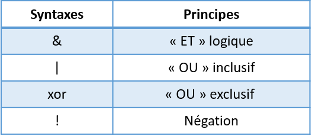

# Présentation {#presentation}

Certaines parties de ce chapitre sont extraites du cours de Julien Barnier "Introduction à R et au tidyverse" (https://juba.github.io/tidyverse)

## Introduction

### À propos de R

R est un langage orienté vers le traitement et l'analyse quantitative des données, dérivé du langage. Il est développé depuis les années 90 par un groupe de volontaires de différents pays et par une grande communauté d'utilisateurs. C'est un logiciel libre, publié sous licence GNU GPL.

Utilisation de R présente plusieurs avantages:

- c'est un logiciel multiplateforme, qui fonctionne aussi bien sur des systèmes Linux, Mac OS X ou Windows.
- c'est un logiciel libre, développé par ses utilisateurs, diffusable et modifiable par tout un chacun.
- c'est un logiciel gratuit.
- c'est un logiciel très puissant, dont les fonctionnalités de base peuvent être étendues à l'aide d'extensions développées par la communauté. Il en existe plusieurs milliers.
- c'est un logiciel dont le développement est très actif et dont la communauté d'utilisateurs et l'utilisation ne cessent de grandir.
- c'est un logiciel avec des capacités graphiques intéressantes.

Comme rien n'est parfait, on peut également trouver quelques inconvénients :

- le logiciel, la documentation de référence et les principales ressources sont en anglais. Il est cependant parfaitement possible d'utiliser R sans spécialement maîtriser cette langue et il existe de plus en plus de ressources francophones.
- R n'est pas un logiciel au sens classique du terme, mais plutôt un langage de programmation. Il fonctionne à l'aide de scripts (des petits programmes) édités et exécutés au fur et à mesure de l'analyse.
- en tant que langage de programmation, R à la réputation d'être difficile d'accès, notamment pour ceux qui n'ont jamais été programmés auparavant.

Au départ cantonné à la sphère universitaire, R est aujourd'hui de plus en plus utilisé dans des grandes entreprises et administrations, car il coûte beaucoup moins cher que ses concurrents (par exemple SAS) tout en étant très peformant.

Ce document ne demande aucun prérequis en informatique ou en programmation. Juste un peu de motivation pour l'apprentissage du langage et, si possible, des données intéressantes sur l'application appliquée les connaissances acquiert.

L'aspect langage de programmation et la difficulté qui en découle peut sembler des inconvénients importants. Le fait de structurer ses analyses sous forme de scripts (suite d'instructions effectuant les différentes opérations d'une analyse) présente cependant de nombreux avantages :

- le script garde par ordre chronologique l'ensemble des étapes d'une analyse, des données des données à leur analyser en passant par les manipulations et les recodages.
- on peut à tout moment revenir en arrière et modifier ce qui a été fait.
- il est très rapide de réexécuter une suite d'opérations complexes.
- on peut très facilement mettre à jour les résultats en cas de modification des sources de données.
- le script garanti, sous certaines conditions, la reproductibilité des résultats obtenus.

###  À propos de RStudio

RStudio n'est pas à proprement parler une interface graphique pour R, il s'agit plutôt d'un *environnement de développement intégré*, qui propose des outils et facilite l'écriture de scripts et l'usage de R au quotidien. C'est une interface bien supérieure à celles fournies par défaut fournies installe R sous Windows ou sous Mac ^ [Sous Linux R n'est fourni que comme un outil en ligne de commande.].

Pour paraphraser [ Hadrien Commenges ](https://elementr.hypotheses.org/237), il n'y a pas d'obligation à utiliser RStudio, mais il y a une obligation à ne pas utiliser les interfaces de R par défaut.

RStudio est également un logiciel libre et gratuit. Une version payante existe, mais elle ne propose pas de fonctionnalités indispensables.


###  À propos du *tidyverse*

Le *tidyverse* est un ensemble d'extensions pour R (code développé par la communauté permettant de rajouter des fonctionnalités à R) construites autour d'une philosophie commune et exercé pour fonctionner ensemble. Elles facilitent l'utilisation de R dans les domaines les plus courants : manipulation des données, recodages, production de graphiques, etc.

###  Structure du document

Ce document est composé de deux grandes fêtes :

- Une *Introduction à R* , qui présente les bases du langage R et de l'interface RStudio
- Une *Introduction au tidyverse* qui présente cet ensemble d'extensions pour la visualisation, la manipulation des données et l'export de résultats


###  Prérequis

Le seul prérequis pour suivre ce document est installé R et RStudio sur votre ordinateur. Il s'agit de deux logiciels libres, gratuits, téléchargeables en ligne et fonctionnant sous PC, Mac et Linux.

Pour l'installateur R, il suffit de se rendre sur une des pages suivantes :

- [ Installer R sous Windows ](https://cloud.r-project.org/bin/windows/base/)
- [ Installateur R sous Mac ](https://cloud.r-project.org/bin/macosx/)

Pour l'installateur RStudio, rendez-vous sur la page suivante et téléchargez la version adaptée à votre système [ https://www.rstudio.com/products/rstudio/download/#download ](https://www.rstudio.com/products/rstudio/download/#download)


## Prise en main

Une fois R et RStudio installés sur votre machine, nous n'allons pas lancer R mais plutôt RStudio.

RStudio n'est pas à proprement parler une interface graphique qui permettrait d'utiliser R de manière "classique" via la souris, des menus et des boîtes de dialogue. Il s'agit plutôt de ce qu'on appelle un *Environnement de développement intégré* (IDE) qui facilite l'utilisation de R et le développement de scripts.

### La console

#### L'invite de commandes

Au premier lancement de RStudio, l'écran principal est découpé en trois grandes zones :
<p>

</p>

La zone de gauche se nomme *Console*. À son démarrage, RStudio a lancé une nouvelle session de R et c'est dans cette fenêtre que nous allons pouvoir interagir avec lui.

La *Console* doit normalement afficher un texte de bienvenue ressemblant à ceci :

```
R version 3.5.2 (2018-12-20) -- "Eggshell Igloo"
Copyright (C) 2018 The R Foundation for Statistical Computing
Platform: x86_64-pc-linux-gnu (64-bit)
R est un logiciel libre livré sans AUCUNE GARANTIE.
Vous pouvez le redistribuer sous certaines conditions.
Tapez 'license()' ou 'licence()' pour plus de détails.
R est un projet collaboratif avec de nombreux contributeurs.
Tapez 'contributors()' pour plus d'information et
'citation()' pour la façon de le citer dans les publications.
Tapez 'demo()' pour des démonstrations, 'help()' pour l'aide
en ligne ou 'help.start()' pour obtenir l'aide au format HTML.
Tapez 'q()' pour quitter R.
```

suivi d'une ligne commençant par le caractère `>` et sur laquelle devrait se trouver votre curseur. Cette ligne est appelée l'*invite de commande* (ou *prompt* en anglais). Elle signifie que R est disponible et en attente de votre prochaine commande.

Nous pouvons tout de suite lui fournir une première commande, en saisissant le texte suivant puis en appuyant sur `Entrée` :

```{r}
2 + 2
```

R nous répond immédiatement, et nous pouvons constater avec soulagement qu'il sait faire des additions à un chiffre^[On peut ignorer pour le moment la présence du `[1]` en début de ligne.]. On peut donc continuer avec d'autres opérations :


```{r}
5 - 7
4 * 12
-10 / 3
5^2
```

Cette dernière opération utilise le symbole `^` qui représente l'opération *puissance*. `5^2` signifie donc "5 au carré", soit 25.

#### Précisions concernant la saisie des commandes

Lorsqu'on saisit une commande, les espaces autour des opérateurs n'ont pas d'importance. Les trois commandes suivantes sont donc équivalentes, mais on privilégie en général la deuxième pour des raisons de lisibilité du code.

```{r eval=FALSE}
10+2
10 + 2
10       +       2
```


Quand vous êtes dans la console, vous pouvez utiliser les flèches vers le haut et vers le bas pour naviguer dans l'historique des commandes que vous avez tapées précédemment. Vous pouvez à tout moment modifier la commande affichée, et l'exécuter en appuyant sur `Entrée`.

Enfin, il peut arriver qu'on saisisse une commande de manière incomplète : oubli d'une parenthèse, faute de frappe, etc. Dans ce cas, R remplace l'invite de commande habituel par un signe `+` :

```{r eval=FALSE}
4 *
+
```

Cela signifie qu'il "attend la suite". On peut alors soit compléter la commande sur cette nouvelle ligne et appuyer sur `Entrée`, soit, si on est perdu, tout annuler et revenir à l'invite de commandes normal en appuyant sur `Esc` ou `Échap`.


### Objets

#### Objets simples

Faire des calculs c'est bien, mais il serait intéressant de pouvoir stocker un résultat quelque part pour pouvoir le réutiliser ultérieurement sans avoir à faire du copier/coller.

Pour conserver le résultat d'une opération, on peut le stocker dans un *objet* à l'aide de l'opérateur d'assignation `<-`. Cette "flèche" stocke ce qu'il y a à sa droite dans un objet dont le nom est indiqué à sa gauche.

Prenons tout de suite un exemple :

```{r}
x <- 2
```

Cette commande peut se lire *"prend la valeur 2 et mets la dans un objet qui s'appelle `x`"*.

Si on exécute une commande comportant juste le nom d'un objet, R affiche son contenu :

```{r}
x
```

On voit donc que notre objet `x` contient bien la valeur 2.

On peut évidemment réutiliser cet objet dans d'autres opérations. R le remplacera alors par sa valeur :

```{r}
x + 4
```

On peut créer autant d'objets qu'on le souhaite.

```{r}
x <- 2
y <- 5
resultat <- x + y
resultat
```


<p style="color:red"> **Attention** </p>

Les noms d'objets peuvent contenir des lettres, des chiffres, les symboles `.` et `_`. Ils ne peuvent pas commencer par un chiffre. Attention, R fait la différence entre minuscules et majuscules dans les noms d'objets, ce qui signifie que `x` et `X` seront deux objets différents, tout comme `resultat` et `Resultat`. 
De manière générale, il est préférable d'éviter les majuscules (pour les risques d'erreur) et les caractères accentués (pour des questions d'encodage) dans les noms d'objets. 
De même, il faut essayer de trouver un équilibre entre clarté du nom (comprendre à quoi sert l'objet, ce qu'il contient) et sa longueur. Par exemple, on préfèrera comme nom d'objet `taille_conj1` à `taille_du_conjoint_numero_1` (trop long) ou à `t1` (pas assez explicite).

Quand on assigne une nouvelle valeur à un objet déjà existant, la valeur précédente est perdue. Les objets n'ont pas de mémoire.

```{r}
x <- 2
x <- 5
x
```

De la même manière, assigner un objet à un autre ne crée pas de "lien" entre les deux. Cela copie juste la valeur de l'objet de droite dans celui de gauche :

```{r}
x <- 1
y <- 3
x <- y
x
### Si on modifie y, cela ne modifie pas x
y <- 4
x
```

On le verra, les objets peuvent contenir tout un tas d'informations. Jusqu'ici on n'a stocké que des nombres, mais ils peuvent aussi contenir des chaînes de caractères (du texte), qu'on délimite avec des guillemets simples ou doubles (`'` ou `"`) :

```{r}
chien <- "Chihuahua"
chien
```


#### Vecteurs

Imaginons maintenant qu'on a demandé la taille en centimètres de 5 personnes et qu'on souhaite calculer leur taille moyenne. On pourrait créer autant d'objets que de tailles et faire l'opération mathématique qui va bien :

```{r}
taille1 <- 156
taille2 <- 164
taille3 <- 197
taille4 <- 147
taille5 <- 173
(taille1 + taille2 + taille3 + taille4 + taille5) / 5
```

Cette manière de faire n'est évidemment pas pratique du tout. On va plutôt stocker l'ensemble de nos tailles dans un seul objet, de type *vecteur*, avec la fonction `combine` appeler avec le raccourci `c` :

```{r}
tailles <- c(156, 164, 197, 147, 173)
```

Si on affiche le contenu de cet objet, on voit qu'il contient bien l'ensemble des tailles saisies :

```{r}
tailles
```

Un *vecteur* dans R est un objet qui peut contenir plusieurs informations du même type, potentiellement en très grand nombre.

L'avantage d'un vecteur est que lorsqu'on lui applique une opération, celle-ci s'applique à toutes les valeurs qu'il contient. Ainsi, si on veut la taille en mètres plutôt qu'en centimètres, on peut faire :

```{r}
tailles_m <- tailles / 100
tailles_m
```

Cela fonctionne pour toutes les opérations de base :

```{r}
tailles + 10
tailles^2
```

Imaginons maintenant qu'on a aussi demandé aux cinq mêmes personnes leur poids en kilos. On peut alors créer un deuxième vecteur :

```{r}
poids <- c(45, 59, 110, 44, 88)
```

On peut alors effectuer des calculs utilisant nos deux vecteurs `tailles` et `poids`. On peut par exemple calculer l'indice de masse corporelle (IMC) de chacun de nos enquêtés en divisant leur poids en kilo par leur taille en mètre au carré :

```{r}
imc <- poids / (tailles / 100) ^ 2
imc
```

Un vecteur peut contenir des nombres, mais il peut aussi contenir du texte. Imaginons qu'on a demandé aux 5 mêmes personnes leur niveau de diplôme : on peut regrouper l'information dans un vecteur de *chaînes de caractères*. Une chaîne de caractère contient du texte libre, délimité par des guillemets simples ou doubles :

```{r}
diplome <- c("CAP", "Bac", "Bac+2", "CAP", "Bac+3")
diplome
```

L'opérateur `:`, lui, permet de générer rapidement un vecteur comprenant tous les nombres entre deux valeurs, opération assez courante sous R :

```{r}
x <- 1:10
x
```

Enfin, notons qu'on peut accéder à un élément particulier d'un vecteur en faisant suivre le nom du vecteur de crochets contenant le numéro de l'élément désiré. Par exemple :

```{r}
diplome[2]
```

Cette opération, qui utilise l'opérateur `[]`, permet donc la sélection d'éléments d'un vecteur.

Dernière remarque, si on affiche dans la console un vecteur avec beaucoup d'éléments, ceux-ci seront répartis sur plusieurs lignes. Par exemple, si on a un vecteur de 50 nombres on peut obtenir quelque chose comme :

     [1] 294 425 339 914 114 896 716 648 915 587 181 926 489
    [14] 848 583 182 662 888 417 133 146 322 400 698 506 944
    [27] 237 324 333 443 487 658 793 288 897 588 697 439 697
    [40] 914 694 126 969 744 927 337 439 226 704 635

On remarque que R ajoute systématiquement un nombre entre crochets au début de chaque ligne : il s'agit en fait de la position du premier élément de la ligne dans le vecteur. Ainsi, le 848 de la deuxième ligne est le 14e élément du vecteur, le 914 de la dernière ligne est le 40e, etc.

Ceci explique le `[1]` qu'on obtient quand on affiche un simple nombre^[Et permet de constater que pour R, un nombre est un vecteur à un seul élément.] :

     [1] 4
     
On peut également effectuer une indexation multiple sur un vecteur si on souhaite sélectionner plusieurs élèments.

```{r}
diplome[c(2,3,4)]
```

On peut également effectuer une indexation *contraire* sur un vecteur en précisant tous les élèments que l'on ne veut pas sélectionner. Pour cela, on utilise le '-' devant l'indexation :

```{r}
diplome[-2]
```

```{r}
diplome[- c(2,4)]
```

#### Type de vecteur

Les vecteurs peuvent être de classes différentes, selon le type de données qu’ils contiennent.
On a ainsi des vecteurs de type `numeric`, `character` ou `logical`:

```{r}
numeric_vec <- c(10,55,49,4)
class(numeric_vec)
```

```{r}
character_vec <- c("Jaune", "Vert", "Bleu", "Rouge")
class(character_vec)
```


```{r}
logical_vec <- c(TRUE,FALSE,FALSE,TRUE)
class(logical_vec)
```

**Attention** : dans un vecteur, tous les éléments sont de même type :

```{r}
un_vecteur <- c("Luca", 30, 2000, FALSE)
class(un_vecteur)
un_vecteur
```

Il existe des fonctions pour tester la classe d'un vecteur. Elles s'écrivent avec le même préfixe `is.classe_a_tester`. Ces fonctions sont des tests logiques donc elles renvoient toujours des booléens.

```{r}
is.numeric(numeric_vec)
is.numeric(character_vec)
```

```{r}
is.character(numeric_vec)
is.character(character_vec)
```

```{r}
is.logical(logical_vec)
is.logical(character_vec)
```

Il est également possible de modifier la classe d'un vecteur avec les fonctions `as.new_class`.

```{r}
as.character(numeric_vec)
as.numeric(logical_vec)
```


Dans R, les variables qualitatives peuvent être de deux types : ou bien des vecteurs de type `character` (des chaînes de caractères), ou bien des `factor` (facteurs).
En R, la classe `factor` est un vecteur contenant uniquement certaines valeurs prédéfinies. Ces valeurs pré-définies sont appelées des `levels`.

```{r}
diplome <- c("CAP", "Bac", "Bac+2", "CAP", "Bac+3")
class(diplome)

diplome <- as.factor(diplome)
diplome
class(diplome)
```

Si on souhaite modifier ou ajouter un élèment avec une modalité qui n'est pas pris en compte dans les `levels`, nous allons avoir une erreur.

```{r ,}
diplome[6] <- "Master"
diplome
```

Il faut donc modifier les `levels` acceptés par le vecteur en amont.

```{r ,}
levels(diplome) <- c(levels(diplome), "Master")
diplome[6] <- "Master"
diplome
```

Mais à quoi peut servir tout cela ? En réalité, l'intérêt principal de la classe `factor` est de prendre moins de place en mémoire car les `levels` sont stockés en `numeric`. Si on transforme notre vecteur en classe `numeric` nous n'allons pas avoir d'erreur.

```{r ,}
class(diplome)
diplome <- as.numeric(diplome)
class(diplome)
diplome
```

On observe que les nombres obtenus correspondent aux numéros de `levels`. Il faut donc faire trés attention lorsqu'on veut passer une classe `numeric` à une variable quantitative importée en tant que `factor`.


### Fonctions

#### Principe

Nous savons désormais effectuer des opérations arithmétiques de base sur des nombres et des vecteurs, et stocker des valeurs dans des objets pour pouvoir les réutiliser plus tard.

Pour aller plus loin, nous devons aborder les *fonctions* qui sont, avec les objets, un deuxième concept de base de R. On utilise des fonctions pour effectuer des calculs, obtenir des résultats et accomplir des actions. 

Formellement, une fonction a un *nom*, elle prend en entrée entre parenthèses un ou plusieurs *arguments* (ou *paramètres*), et retourne un *résultat*.

Prenons tout de suite un exemple. Si on veut connaître le nombre d'éléments du vecteur `tailles` que nous avons construit précédemment, on peut utiliser la fonction `length`, de cette manière :

```{r}
length(tailles)
```

Ici, `length` est le nom de la fonction, on l'appelle en lui passant un argument entre parenthèses (en l'occurrence notre vecteur `tailles`), et elle nous renvoie un résultat, à savoir le nombre d'éléments du vecteur passé en paramètre.

Autre exemple, les fonctions `min` et `max` retournent respectivement les valeurs minimales et maximales d'un vecteur de nombres :

```{r}
min(tailles)
max(tailles)
```

La fonction `mean` calcule et retourne la moyenne d'un vecteur de nombres :

```{r}
mean(tailles)
```

La fonction `sum` retourne la somme de tous les éléments du vecteur :

```{r}
sum(tailles)
```


Jusqu'à présent on n'a vu que des fonctions qui calculent et retournent un unique nombre. Mais une fonction peut renvoyer d'autres types de résultats. Par exemple, la fonction `range` (étendue) renvoie un vecteur de deux nombres, le minimum et le maximum :

```{r}
range(tailles)
```

Ou encore, la fonction `unique`, qui supprime toutes les valeurs en double dans un vecteur, qu'il s'agisse de nombres ou de chaînes de caractères :

```{r}
diplome <- c("CAP", "Bac", "Bac+2", "CAP", "Bac+3")
unique(diplome)
```


#### Arguments

Une fonction peut prendre plusieurs arguments, dans ce cas on les indique toujours entre parenthèses, séparés par des virgules. 

On a déjà rencontré un exemple de fonction acceptant plusieurs arguments : la fonction `c`, qui combine l'ensemble de ses arguments en un vecteur^[`c` est l'abréviation de *combine*, son nom est très court car on l'utilise très souvent] :

```{r}
tailles <- c(156, 164, 197, 181, 173)
```

Ici, `c` est appelée en lui passant cinq arguments, les cinq tailles séparées par des virgules, et elle renvoie un vecteur numérique regroupant ces cinq valeurs.

Supposons maintenant que dans notre vecteur `tailles` nous avons une valeur manquante (une personne a refusé de répondre). On symbolise celle-ci dans R avec le code interne `NA` :

```{r}
tailles <- c(156, 164, 197, NA, 173)
tailles
```


`NA` est l'abréviation de *Not available*, non disponible. Cette valeur particulière peut être utilisée pour indiquer une valeur manquante, qu'il s'agisse d'un nombre, d'une chaîne de caractères, etc.

Si je calcule maintenant la taille moyenne à l'aide de la fonction `mean`, j'obtiens :

```{r}
mean(tailles)
```

En effet, R considère par défaut qu'il ne peut pas calculer la moyenne si une des valeurs n'est pas disponible. Il considère alors que cette moyenne est elle-même "non disponible" et renvoie donc comme résultat `NA`.

On peut cependant indiquer à `mean` d'effectuer le calcul en ignorant les valeurs manquantes. Ceci se fait en ajoutant un argument supplémentaire, nommé `na.rm` (abréviation de *NA remove*, "enlever les NA"), et de lui attribuer la valeur `TRUE` (code interne de R signifiant *vrai*) :

```{r}
mean(tailles, na.rm = TRUE)
```

Positionner le paramètre `na.rm` à `TRUE`  indique à la fonction `mean` de ne pas tenir compte des valeurs manquantes dans le calcul.

Si on ne dit rien à la fonction `mean`, cet argument a une valeur par défaut, en l'occurrence `FALSE` (faux), qui fait qu'il ne supprime pas les valeurs manquantes. Les deux commandes suivantes sont donc rigoureusement équivalentes :

```{r}
mean(tailles)
mean(tailles, na.rm = FALSE)
```


Lorsqu'on passe un argument à une fonction de cette manière, c'est-à-dire sous la forme `nom = valeur`, on parle d'*argument nommé*.


#### Aide sur une fonction

Il est fréquent de ne pas savoir (ou d'avoir oublié) quels sont les arguments d'une fonction, ou comment ils se nomment. On peut à tout moment faire appel à l'aide intégrée à R en passant le nom de la fonction (entre guillemets) à la fonction `help` :

```{r, eval = FALSE}
help("mean")
```
```{r, eval = FALSE}
?mean
```

On peut aussi utiliser le raccourci `?mean`.

Ces deux commandes affichent une page (en anglais) décrivant la fonction, ses paramètres, son résultat, le tout accompagné de diverses notes, références et exemples. Ces pages d'aide contiennent à peu près tout ce que vous pourrez chercher à savoir, mais elles ne sont pas toujours d'une lecture aisée.

Dans RStudio, les pages d'aide en ligne s'ouvriront par défaut dans la zone en bas à droite,
sous l'onglet *Help*. Un clic sur l'icône en forme de maison vous affichera la page d'accueil de l'aide.

#### Programmer des fonctions

Il est possible de programmer ses propres fonctions. Dans l'exemple ci-dessous on construit une fonction `imc`q ui prend en entrée deux arguments `poids` et `taille`. La fonction effectue un calcul et renvoi l'IMC. Pour construire une fonction, on doit obligatoirement faire appel au mot clé `function`. Le mot clé `return` n'est pas obligatoire. Cependant, par convention, une fonction renvoie toujours un résultat qui peut aussi être un message d'information sur le bon déroulement de celle-ci. Les arguments sont précisés entre parenthèses  `( )`. Les traitements s'effectuent entre accolades `{ }`.

```{r}
imc <- function(taille,poids) {
   calcul <- poids / (taille^2)
   return (calcul) }
```

Lorsqu'on vérifie la classe de l'objet `imc` en mémoire, on constate qu'il est bien de type `function`.

```{r}
class(imc)
```

Puis c'est le même principe que les autres fonctions pour l'utiliser :
```{r}
imc(taille = 1.55, poids = 49)
```

Il est possible de préciser des arguments par défaut. Ils sont à saisir dans la définition des arguments :

```{r}
imc <- function(taille = 1.70, poids = 60) {
   calcul <- poids / (taille^2)
   return (calcul) }

imc()
```

## Fonctions de tests et comparaisons

Dans R, il est possible d’effectuer des comparaisons ou des tests qui vont retourner la valeur `TRUE` si vrai et `FALSE` si faux

### Opérateurs de comparaisons

Voici les différents opérateurs de comparaisons que l’on peut utiliser :

<p>

</p>

```{r}
a <- c(1,3,5,9)
b <- c(1,2,6,9)
```
```{r}
a > b
a == b
a != b
```

### Opérateurs logiques

Ces opérateurs permettent de tester l'effet de plusieurs tests logiques.

<p>

</p>

```{r}
a <- c(1,3,5,9)
b <- c(1,2,6,9)
```
```{r}
(a > b) & ( a > 4)
(a == b) | (a > 4)
```

```{r}
xor(a > b, a > 4)
```

```{r}
a > b
! a > b
```

### Fonctions logiques

Il existe des fonctions pour effectuer des tests logiques. Elles ont toutes le même préfixe et s'écrivent `is.mon_test`. On peut par exemple tester la classe d'un **objet** avec les fonctions `is.classe_a_tester`. Ces fonctions sont des tests logiques donc elles renvoient toujours des booléens (rappel TD1).


```{r}
numeric_vec <- c(10,55,49,4)
class(numeric_vec)
character_vec <- c("Jaune", "Vert", "Bleu", "Rouge")
class(character_vec)
```

```{r}
is.numeric(numeric_vec)
is.numeric(character_vec)
```

```{r}
is.character(numeric_vec)
is.character(character_vec)
```

On peut aussi tester la présence `FALSE`/ `TRUE` de valeurs manquantes `NA` avec la fonction `is.na`.

```{r}
a <- c(1,NA,6,9)
is.na(a)
```


## Regrouper ses commandes dans des scripts

Jusqu'ici on a utilisé R de manière "interactive", en saisissant des commandes directement dans la console. Ça n'est cependant pas la manière dont on va utiliser R au quotidien, pour une raison simple : lorsque R redémarre, tout ce qui a été effectué dans la console est perdu.

Plutôt que de saisir nos commandes dans la console, on va donc les regrouper dans des scripts (de simples fichiers texte), qui vont garder une trace de toutes les opérations effectuées, et ce sont ces scripts, sauvegardés régulièrement, qui seront le "coeur" de notre travail. C'est en rouvrant les scripts et en réexécutant les commandes qu'ils contiennent qu'on pourra "reproduire" les données, leur traitement, les analyses et leurs résultats.

Pour créer un script, il suffit de sélectionner le menu *File*, puis *New file* et *R script*. Une quatrième zone apparaît alors en haut à gauche de l'interface de RStudio. On peut enregistrer notre script à tout moment dans un fichier avec l'extension `.R`, en cliquant sur l'icône de disquette ou en choisissant  *File* puis *Save*.

Un script est un fichier texte brut, qui s'édite de la manière habituelle. À la différence de la console, quand on appuie sur `Entrée`, cela n'exécute pas la commande en cours mais insère un saut de ligne (comme on pouvait s'y attendre).

Pour exécuter une commande saisie dans un script, il suffit de positionner le curseur sur la ligne de la commande en question, et de cliquer sur le bouton *Run* dans la barre d'outils juste au-dessus de la zone d'édition du script. On peut aussi utiliser le raccourci clavier `Ctrl + Entrée` (`Cmd + Entrée` sous Mac). On peut enfin sélectionner plusieurs lignes avec la souris ou le clavier et cliquer sur *Run* (ou utiliser le raccourci clavier), et l'ensemble des lignes est exécuté d'un coup.

Finalement, un script pourra ressembler à quelque chose comme ça :

```{r, eval=FALSE}
tailles <- c(156, 164, 197, 147, 173)
poids <- c(45, 59, 110, 44, 88)
mean(tailles)
mean(poids)
imc <- poids / (tailles / 100) ^ 2
min(imc)
max(imc)
```


### Commentaires

Les commentaires sont un élément très important d'un script. Il s'agit de texte libre, ignoré par R, et qui permet de décrire les étapes du script, sa logique, les raisons pour lesquelles on a procédé de telle ou telle manière... Il est primordial de documenter ses scripts à l'aide de commentaires, car il est très facile de ne plus se retrouver dans un programme qu'on a produit soi-même, même après une courte interruption.

Pour ajouter un commentaire, il suffit de le faire précéder d'un ou plusieurs symboles `#`. En effet, dès que R rencontre ce caractère, il ignore tout ce qui se trouve derrière, jusqu’à la fin de la ligne.

On peut donc documenter le script précédent :

```{r, eval=FALSE}
# Saisie des tailles et poids des enquêtés
tailles <- c(156, 164, 197, 147, 173)
poids <- c(45, 59, 110, 44, 88)
# Calcul des tailles et poids moyens
mean(tailles)
mean(poids)
# Calcul de l'IMC (poids en kilo divisé par les tailles en mètre au carré)
imc <- poids / (tailles / 100) ^ 2
# Valeurs extrêmes de l'IMC
min(imc)
max(imc)
```


## Installer et charger des extensions (*packages*)

R étant un logiciel libre, il bénéficie d'un développement communautaire riche et dynamique. L'installation de base de R permet de faire énormément de choses, mais le langage dispose en plus d'un système d'extensions permettant d'ajouter facilement de nouvelles fonctionnalités. La plupart des extensions sont développées et maintenues par la communauté des utilisateurs de R, et diffusées via un réseau de serveurs nommé CRAN (*Comprehensive R Archive Network*).

Pour installer une extension, si on dispose d'une connexion Internet, on peut utiliser le bouton *Install* de l'onglet *Packages* de RStudio. 
<p>

</p>

Il suffit alors d'indiquer le nom de l'extension dans le champ *Package* et de cliquer sur *Install*.

<p>

</p>

On peut aussi installer des extensions en utilisant la fonction `install.packages()` directement dans la console. Par exemple, pour installer le *package* `questionr` on peut exécuter la commande :

```{r, eval = FALSE}
install.packages("questionr")
```

Installer une extension via l'une des deux méthodes précédentes va télécharger l'ensemble des fichiers nécessaires depuis l'une des machines du CRAN, puis installer tout ça sur le disque dur de votre ordinateur. Vous n'avez besoin de le faire qu'une fois, comme vous le faites pour installer un programme sur votre Mac ou PC.
Cela suppose que vous disposez d'une connexion internet. Cependant, il est possible d'installer des packages en local sans connexion internet sous réserve d'être en possession des packages en fichiers zippés.

Une fois l'extension installée, il faut la "charger" avant de pouvoir utiliser les fonctions qu'elle propose. Ceci se fait avec la fonction `library`. Par exemple, pour pouvoir utiliser les fonctions de `questionr`, vous devrez exécuter la commande suivante :

```{r eval = FALSE}
library(questionr)
```

Ainsi, bien souvent, on regroupe en début de script toute une série d'appels à `library` qui permettent de charger tous les packages utilisés dans le script. Quelque chose comme :

```{r, eval = FALSE}
library(readxl)
library(ggplot2)
library(questionr)
```

Si vous essayez d'exécuter une fonction d'une extension et que vous obtenez le message d'erreur `impossible de trouver la fonction`, c'est certainement parce que vous n'avez pas exécuté la commande `library` correspondante.


## Exercices

### Sujet

**Exercice 1**

a. Construire le vecteur `x` suivant :

```{r echo=FALSE}
x <- c(120, 134, 256, 12)
x
```

b. Utiliser ce vecteur `x` pour générer les deux vecteurs suivants :

```{r echo=FALSE}
x + 100
x * 2
```

**Exercice 2**

On a demandé à 4 ménages le revenu des deux conjoints, et le nombre de personnes du ménage :

```{r eval=FALSE}
conjoint1 <- c(1200, 1180, 1750, 2100)
conjoint2 <- c(1450, 1870, 1690, 0)
nb_personnes <- c(4, 2, 3, 2)
```

Calculer le revenu total de chaque ménage, puis diviser par le nombre de personnes pour obtenir le revenu par personne de chaque ménage.

**Exercice 3**

a. Dans l'exercice précédent, calculer le revenu minimum et maximum parmi ceux du premier conjoint. 

```{r eval=FALSE}
conjoint1 <- c(1200, 1180, 1750, 2100)
```

b. Recommencer avec les revenus suivants, parmi lesquels l'un des enquêtés n'a pas voulu répondre :

```{r eval=FALSE}
conjoint1 <- c(1200, 1180, 1750, NA)
```

**Exercice 4**

Les deux vecteurs suivants représentent les précipitations (en mm) et la température (en °C) moyennes sur la ville de Lyon, pour chaque mois de l'année, entre 1981 et 2010 :

```{r}
temperature <- c(3.4, 4.8, 8.4, 11.4, 15.8, 19.4, 22.2, 21.6, 17.6, 13.4, 7.6, 4.4)
precipitations <- c(47.2, 44.1, 50.4, 74.9, 90.8, 75.6, 63.7, 62, 87.5, 98.6, 81.9, 55.2)
```

a. Calculer la température moyenne sur l'année.

b. Calculer la quantité totale de précipitations sur l'année.

c. À quoi correspond et comment peut-on interpréter le résultat de la fonction suivante ? Vous pouvez vous aider de la page d'aide de la fonction si nécessaire.

```{r}
cumsum(precipitations)
```

d. Même question pour :

```{r}
diff(temperature)
```

**Exercice 5**

On a relevé les notes en maths, anglais et sport d'une classe de 6 élèves et on a stocké ces données dans trois vecteurs :

```{r}
maths <- c(12, 16, 8, 18, 6, 10)
anglais <- c(14, 9, 13, 15, 17, 11)
sport <- c(18, 11, 14, 10, 8, 12)
```

a. Calculer la moyenne des élèves de la classe en anglais.

b. Calculer la moyenne générale de chaque élève.

c. Essayez de comprendre le résultat des deux fonctions suivantes (vous pouvez vous aider de la page d'aide de ces fonctions) :

```{r}
pmin(maths, anglais, sport)
```

```{r}
pmax(maths, anglais, sport)
```


### Correction

**Exercice 1**

a. Construire le vecteur `x` suivant :

```{r echo=FALSE}
x <- c(120, 134, 256, 12)
x
```

```{r eval=FALSE}
x <- c(120, 134, 256, 12)
```

b. Utiliser ce vecteur `x` pour générer les deux vecteurs suivants :

```{r echo=FALSE}
x + 100
x * 2
```

```{r eval=FALSE}
x + 100
x * 2
```

**Exercice 2**

On a demandé à 4 ménages le revenu des deux conjoints, et le nombre de personnes du ménage :

```{r eval=FALSE}
conjoint1 <- c(1200, 1180, 1750, 2100)
conjoint2 <- c(1450, 1870, 1690, 0)
nb_personnes <- c(4, 2, 3, 2)
```

Calculer le revenu total de chaque ménage, puis diviser par le nombre de personnes pour obtenir le revenu par personne de chaque ménage.

```{r eval=FALSE}
revenu_total <- conjoint1 + conjoint2
revenu_total / nb_personnes
```

**Exercice 3**

a. Dans l'exercice précédent, calculer le revenu minimum et maximum parmi ceux du premier conjoint. 

```{r eval=FALSE}
conjoint1 <- c(1200, 1180, 1750, 2100)
```

```{r eval=FALSE}
range(conjoint1)
```

b. Recommencer avec les revenus suivants, parmi lesquels l'un des enquêtés n'a pas voulu répondre :

```{r eval=FALSE}
conjoint1 <- c(1200, 1180, 1750, NA)
```

```{r eval=FALSE}
range(conjoint1, na.rm = TRUE)
```

**Exercice 4**

Les deux vecteurs suivants représentent les précipitations (en mm) et la température (en °C) moyennes sur la ville de Lyon, pour chaque mois de l'année, entre 1981 et 2010 :

```{r}
temperature <- c(3.4, 4.8, 8.4, 11.4, 15.8, 19.4, 22.2, 21.6, 17.6, 13.4, 7.6, 4.4)
precipitations <- c(47.2, 44.1, 50.4, 74.9, 90.8, 75.6, 63.7, 62, 87.5, 98.6, 81.9, 55.2)
```

a. Calculer la température moyenne sur l'année.

```{r eval=FALSE}
mean(temperature)
```

b. Calculer la quantité totale de précipitations sur l'année.

```{r eval=FALSE}
sum(precipitations)
```

c. À quoi correspond et comment peut-on interpréter le résultat de la fonction suivante ? Vous pouvez vous aider de la page d'aide de la fonction si nécessaire.

```{r}
cumsum(precipitations)
```

d. Même question pour :

```{r}
diff(temperature)
```

`cumsum(precipitations)` correspond à la somme cumulée des précipitations sur l'année. Par exemple, la 6e valeur du vecteur résultat correspond au total de précipitations de janvier à juin.

`diff(temperature)` correspond à la différence de température d'un mois sur l'autre. Par exemple, la 2e valeur de ce vecteur correspond à l'écart de température entre le mois de février et le mois de janvier.

**Exercice 5**

On a relevé les notes en maths, anglais et sport d'une classe de 6 élèves et on a stocké ces données dans trois vecteurs :

```{r}
maths <- c(12, 16, 8, 18, 6, 10)
anglais <- c(14, 9, 13, 15, 17, 11)
sport <- c(18, 11, 14, 10, 8, 12)
```

a. Calculer la moyenne des élèves de la classe en anglais.

```{r eval=FALSE}
mean(anglais)
```

b. Calculer la moyenne générale de chaque élève.

```{r eval=FALSE}
(maths + anglais + sport) / 3
```

c. Essayez de comprendre le résultat des deux fonctions suivantes (vous pouvez vous aider de la page d'aide de ces fonctions) :

```{r}
pmin(maths, anglais, sport)
```

```{r}
pmax(maths, anglais, sport)
```

`pmin` et `pmax` renvoient les minimum et maximum "parallèles" des trois vecteurs passés en argument. Ainsi, `pmin` renvoie pour chaque élève la note minimale dans les trois matières, et `pmax` la note maximale.


## Testez vos connaissances !

<p>

</p>

Testez vos connaissances sur ce chapitre avec ce quiz (10 min) en [cliquant ici](https://kahoot.it/challenge/07461866?challenge-id=93264293-c5c0-4eb8-8381-2ba18c649ca3_1616285335156).

