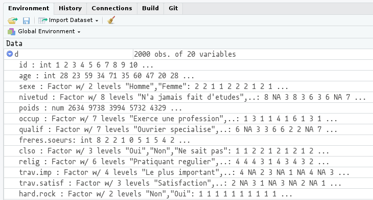

# Premier travail avec des données {#first_dataset}

Certaines parties de ce chapitre sont extraites du cours de Julien Barnier "Introduction à R et au tidyverse" (https://juba.github.io/tidyverse)

## Jeu de données d'exemple

Dans cette partie nous allons (enfin) travailler sur des "vraies" données, et utiliser un jeu de données présent dans l'extension `questionr`. Nous devons donc avant toute chose installer cette extension.

Pour installer ce package, deux possibilités :

- Dans l'onglet *Packages* de la zone de l'écran en bas à droite, cliquez sur le bouton *Install*. Dans le dialogue qui s'ouvre, entrez "questionr" dans le champ *Packages* puis cliquez sur *Install*.
- Saisissez directement la commande suivante dans la console : `install.packages("questionr")`

Dans les deux cas, tout un tas de messages devraient s'afficher dans la console. Attendez que l'invite de commandes `>` apparaisse à nouveau.

Le jeu de données que nous allons utiliser est un extrait de l'enquête *Histoire de vie* réalisée par l'INSEE en 2003. Il contient 2000 individus et 20 variables.

Pour pouvoir utiliser ces données, il faut d'abord charger l'extension `questionr` (après l'avoir installée, bien entendu) :

```{r}
library(questionr)
```

L'utilisation de `library` permet de rendre "disponibles", dans notre session R, les fonctions et jeux de données inclus dans l'extension.

Nous devons ensuite indiquer à R que nous souhaitons accéder au jeu de données à l'aide de la commande `data` :

```{r}
data(hdv2003)
```

Cette commande ne renvoie aucun résultat particulier (sauf en cas d'erreur), mais vous devriez voir apparaître dans l'onglet *Environment* de RStudio un nouvel objet nommé `hdv2003` :

<p>

</p>

Cet objet est d'un type nouveau : il s'agit d'un tableau de données.


## Tableau de données (*data frame*)


Un *data frame* (ou tableau de données, ou table) est un type d'objet R qui contient des données au format tabulaire, avec les observations en ligne et les variables en colonnes, comme dans une feuille de tableur de type LibreOffice ou Excel.

Si on se contente d'exécuter le nom de notre tableau de données :

```{r, eval=FALSE}
hdv2003
```

R va, comme à son habitude, nous l'afficher dans la console, ce qui est tout sauf utile.

Une autre manière d'afficher le contenu du tableau est de cliquer sur l'icône en forme de tableau à droite du nom de l'objet dans l'onglet *Environment* :

<p>

</p>

Ou d'utiliser la fonction `View` :

```{r, eval = FALSE}
View(x = hdv2003)
```

Dans les deux cas votre tableau devrait s'afficher dans RStudio avec une interface de type tableur :

<p>

</p>

Il est important de comprendre que l'objet `hdv2003` contient *l'intégralité* des données du tableau. 
On voit donc qu'un objet peut contenir des données de types très différents (simple nombre, texte, vecteur, tableau de données entier), et être potentiellement de très grande taille^[La seule limite pour la taille d'un objet étant la mémoire vive (RAM) de la machine sur laquelle tourne la session R.].

Sous R, on peut importer ou créer autant de tableaux de données qu'on le souhaite, dans les limites des capacités de sa machine.

Un *data frame* peut être manipulé comme les autres objets vus précédemment. On peut par exemple faire :

```{r}
d <- hdv2003
```

ce qui va entraîner la copie de l'ensemble de nos données dans un nouvel objet nommé `d`. Ceci peut paraître parfaitement inutile mais a en fait l'avantage de fournir un objet avec un nom beaucoup plus court, ce qui diminuera la quantité de texte à saisir par la suite.

**Pour résumer**, comme nous avons désormais décidé de saisir nos commandes dans un script et non plus directement dans la console, les premières lignes de notre fichier de travail sur les données de l'enquête *Histoire de vie* pourraient donc ressembler à ceci :


```{r, eval = FALSE}
## Chargement des extensions nécessaires
library(questionr)
## Jeu de données hdv2003
data(hdv2003)
d <- hdv2003
```


### Structure du tableau

Un tableau étant un objet comme un autre, on peut lui appliquer des fonctions. Par exemple, `nrow` et `ncol` retournent le nombre de lignes et de colonnes du tableau :

```{r}
nrow(x = d)
```

```{r}
ncol(x = d)
```

La fonction `dim` renvoie ses dimensions, donc les deux nombres précédents :

```{r}
dim(x = d)
```

La fonction `names` retourne les noms des colonnes du tableau, c'est-à-dire la liste de nos *variables* :

```{r}
names(x = d)
```

On peut aussi utiliser la fonction `colnames` :
```{r}
colnames(x = d)
```

Enfin, la fonction `str` renvoie un descriptif plus détaillé de la structure du tableau. Elle liste les différentes variables, indique leur type ^[Les différents types de variables seront décrits plus en détail dans un autre TD sur les recodages.] et affiche les premières valeurs :

```{r}
str(object = d)
```


Sous RStudio, on peut afficher à tout moment la structure d'un objet en cliquant sur l'icône de triangle sur fond bleu à gauche du nom de l'objet dans l'onglet *Environment* :

<p>

</p>

### Accéder aux variables d'un tableau

Une opération très importante est l'accès aux variables du tableau (à ses colonnes) pour pouvoir les manipuler, effectuer des calculs, etc. On utilise pour cela l'opérateur `$`, qui permet d'accéder aux colonnes du tableau. Ainsi, si l'on tape :

```{r include=FALSE}
options(max.print = 200)
```


```{r}
d$sexe
```

R va nous afficher l'ensemble des valeurs de notre variable `sexe` dans la console, ce qui est à nouveau fort peu utile. Mais cela nous permet de constater que `d$sexe` est un vecteur de chaînes de caractères tels qu'on en a déjà rencontré précédemment. Pour le moment, on ne fait pas attention à `Levels: Homme Femme`

La fonction `table$colonne` renvoie donc la colonne nommée `colonne` du tableau `table`, c'est-à-dire un vecteur, en général de nombres ou de chaînes de caractères.

Si on souhaite afficher seulement les premières ou dernières valeurs d'une variable, on peut utiliser les fonctions `head` et `tail` :

```{r}
head(x = d$age)
```


```{r}
tail(x = d$age, 10)
```

Le deuxième argument numérique permet d'indiquer le nombre de valeurs à afficher.

### Créer une nouvelle variable

On peut aussi utiliser l'opérateur `$` pour créer une nouvelle variable dans notre tableau : pour cela, il suffit de lui assigner une valeur.

Par exemple, la variable `heures.tv` contient le nombre d'heures passées quotidiennement devant la télé :

```{r}
head(x = d$heures.tv, n = 10)
```

On peut vouloir créer une nouvelle variable dans notre tableau qui contienne la même durée mais en minutes. On va donc créer une nouvelle variable `minutes.tv` de la manière suivante :

```{r}
d$minutes.tv <- d$heures.tv * 60
```

On peut alors constater, soit visuellement soit dans la console, qu'une nouvelle variable (une nouvelle colonne) a bien été ajoutée au tableau :

```{r}
head(x = d$minutes.tv)
```

On peut également supprimer une colonne d'un data frame en utilisant `<- NULL`

```{r}
#création d'une colonne temporaire
d$temp <- NA

#vérification de la création de la colonne
d$temp

#nombre de colonne avant la suppression
ncol(x = d)

#suppression de la colonne
d$temp <- NULL

#nombre de colonne après la suppression
ncol(x = d)
```

## Analyse univariée

On a donc désormais accès à un tableau de données `d`, dont les lignes sont des observations (des individus enquêtés), et les colonnes des variables (des caractéristiques de chacun de ces individus), et on sait accéder à ces variables grâce à l'opérateur `$`. 

Si on souhaite analyser ces variables, les méthodes et fonctions utilisées seront différentes selon qu'il s'agit d'une variable *quantitative* (variable numérique pouvant prendre un grand nombre de valeurs : l'âge, le revenu, un pourcentage...) ou d'une variable *qualitative* (variable pouvant prendre un nombre limité de valeurs appelées modalités : le sexe, la profession, le dernier diplôme obtenu, etc.).

### Analyser une variable quantitative

Une variable quantitative est une variable de type numérique (un nombre) qui peut prendre un grand nombre de valeurs. On en a plusieurs dans notre jeu de données, notamment l'âge (variable `age`) ou le nombre d'heures passées devant la télé (`heures.tv`).


#### Indicateurs de position

Caractériser une variable quantitative, c'est essayer de décrire la manière dont ses valeurs se répartissent, ou se distribuent.

Pour cela on peut commencer par regarder les valeurs extrêmes, avec les fonctions `min`, `max` ou `range` :

```{r}
min(x = d$age)
max(x = d$age)
range(x = d$age)
```

On peut aussi calculer des indicateurs de *position* : ceux-ci indiquent autour de quel nombre se répartissent les valeurs de la variable. Il y en a plusieurs, le plus connu étant la moyenne, qu'on peut calculer avec la fonction `mean` :

```{r}
mean(x = d$age)
```

Il existe aussi la médiane, qui est la valeur qui sépare notre population en deux : on a la moitié de nos observations en-dessous, et la moitié au-dessus. Elle se calcule avec la fonction `median` :

```{r}
median(x = d$age)
```

Une différence entre les deux indicateurs est que la médiane est beaucoup moins sensible aux valeurs "extrêmes" : on dit qu'elle est plus *robuste*. Ainsi, en 2013, le salaire net *moyen* des salariés à temps plein en France était de 2202 euros, tandis que le salaire net *médian* n'était que de 1772 euros. La différence étant due à des très hauts salaires qui "tirent" la moyenne vers le haut.


#### Indicateurs de dispersion

Les indicateurs de dispersion permettent de mesurer si les valeurs sont plutôt regroupées ou au contraire plutôt dispersées.

L'indicateur le plus simple est l'étendue de la distribution, qui décrit l'écart maximal observé entre les observations :

```{r}
max(d$age) - min(d$age)
```

Les indicateurs de dispersion les plus utilisés sont la variance ou, de manière équivalente, l'écart-type (qui est égal à la racine carrée de la variance). On obtient la première avec la fonction `var`, et le second avec `sd` (abréviation de *standard deviation*) :

```{r}
var(x = d$age)
```

```{r}
sd(x = d$age)
```

Plus la variance ou l'écart-type sont élevés, plus les valeurs sont dispersées autour de la moyenne. À l'inverse, plus ils sont faibles et plus les valeurs sont regroupées.

Une autre manière de mesurer la dispersion est de calculer les quartiles :

- le premier quartile est la valeur pour laquelle on a 25% des observations en dessous et 75% au-dessus
- le deuxième quartile est la valeur pour laquelle on a 50% des observations en dessous et 50% au-dessus (c'est donc la médiane)
- le troisième quartile est la valeur pour laquelle on a 75% des observations en dessous et 25% au-dessus

On peut les calculer avec la fonction `quantile` :

```{r}
## Premier quartile
quantile(x = d$age, probs = 0.25)
```

```{r}
## Troisième quartile
quantile(x = d$age, probs = 0.75)
```

L'argument `quantile` prend deux arguments principaux : le vecteur dont on veut calculer le quantile, et un argument `prob` qui indique quel quantile on souhaite obtenir. `prob` prend une valeur entre 0 et 1 : 0.5 est la médiane, 0.25 le premier quartile, 0.1 le premier décile, etc.
Par défaut, la fonction quantile affiche le min, max et les quartiles de la série :
```{r}
quantile(x = d$age)
```

Attention ! 
L'ensemble les fonctions statistiques sont sensibles à la présence de valeurs manquantes `NA`. On utilisera l'argument `na.rm = TRUE` pour éviter les erreurs.

Notons enfin que la fonction `summary` permet d'obtenir d'un coup plusieurs indicateurs classiques :

```{r}
summary(object = d$age)
```

#### Représentation graphique

L'outil le plus utile pour étudier la distribution des valeurs d'une variable quantitative reste la représentation graphique. 

La représentation la plus courante est sans doute l'histogramme. On peut l'obtenir avec la fonction `hist` :

```{r, fig.width= 12, fig.height=4}
hist(x = d$age)
```

Cette fonction n'a pas pour effet direct d'effectuer un calcul ou de nous renvoyer un résultat : elle génère un graphique qui va s'afficher dans l'onglet *Plots* de RStudio.

On peut personnaliser l'apparence de l'histogramme en ajoutant des arguments supplémentaires à la fonction `hist`. L'argument le plus important est `breaks`, qui permet d'indiquer le nombre de classes que l'on souhaite.

```{r, fig.width= 12, fig.height=4}
hist(x = d$age, breaks = 10)
```

```{r, fig.width= 12, fig.height=4}
hist(x = d$age, breaks = 70)
```


Le choix d'un "bon" nombre de classes pour un histogramme n'est pas un problème simple : si on a trop peu de classes, on risque d'effacer quasiment toutes les variations, et si on en a trop on risque d'avoir trop de détails et de masquer les grandes tendances.

Les arguments de `hist` permettent également de modifier la présentation du graphique. On peut ainsi changer la couleur des barres avec `col`^[Les différentes manières de spécifier des couleurs seront abordées plus tard.], le titre avec `main`, les étiquettes des axes avec `xlab` et `ylab`, etc. :

```{r, fig.width= 12, fig.height=4}
hist(x = d$age, col = "skyblue",
     main = "Répartition des ages des enquêtés",
     xlab = "age",
     ylab = "Effectif")
```

La fonction `hist` fait partie des fonctions graphique de base de R. Elle est souvent associée au graphique boîtes à moustaches (*boxplot*) qui permet de résumer la distribution d'une variable quantitative à travers les quartiles notamment.

```{r, fig.width= 4, fig.height=4}
boxplot(x = d$age, main = "Distribution de l'age")
```

### Analyser une variable qualitative

Une variable qualitative est une variable qui ne peut prendre qu'un nombre limité de valeurs, appelées modalités. Dans notre jeu de données on trouvera par exemple le sexe (`sexe`), le niveau d'études (`nivetud`), la catégorie socio-professionnelle (`qualif`)...

À noter qu'une variable qualitative peut tout-à-fait être numérique, et que certaines variables peuvent être traitées soit comme quantitatives, soit comme qualitatives : c'est le cas par exemple du nombre d'enfants ou du nombre de frères et soeurs.

#### Tri à plat

L'outil le plus utilisé pour représenter la répartition des valeurs d'une variable qualitative est le *tri à plat* : il s'agit simplement de compter, pour chacune des valeurs possibles de la variable (pour chacune des modalités), le nombre d'observations ayant cette valeur. Un tri à plat s'obtient sous R à l'aide de la fonction `table` :

```{r}
table(x = d$sexe)
```

Ce tableau nous indique donc que parmi nos enquêtés on trouve 899 hommes et 1101 femmes.

```{r}
table(x = d$qualif)
```

Un tableau de ce type peut être affiché ou stocké dans un objet, et on peut à son tour lui appliquer des fonctions. Par exemple, la fonction `sort` permet de trier le tri à plat selon la valeur de l'effectif. On peut donc faire :

```{r}
tab <- table(x = d$qualif)
sort(tab)
```

Attention, par défaut la fonction `table` n'affiche pas les valeurs manquantes (`NA`). Si on souhaite les inclure il faut utiliser l'argument `useNA = "always"`, soit : `table(d$qualif, useNA = "always")`. À noter qu'on peut aussi appliquer `summary` à une variable qualitative. Le résultat est également le tri à plat de la variable, avec en plus le nombre de valeurs manquantes éventuelles :

```{r}
summary(object = d$qualif)
```

Par défaut ces tris à plat sont en effectifs et ne sont donc pas toujours très lisibles, notamment quand on a des effectifs importants. On leur rajoute donc en général la répartition en pourcentages. Pour cela, nous allons utiliser la fonction `freq` de l'extension `questionr`, qui devra donc avoir précédemment été chargée avec `library(questionr)` :

```{r}
## À rajouter en haut de script et à exécuter
library(questionr)
```

On peut alors utiliser la fonction :

```{r, eval=FALSE}
freq(x = d$qualif)
```
```{r, echo=FALSE}
print(freq(x = d$qualif))
```

La colonne `n` représente les effectifs de chaque catégorie, la colonne `%` le pourcentage, et la colonne `val%` le pourcentage calculé sur les valeurs valides, donc en excluant les `NA`. Une ligne a également été rajoutée pour indiquer le nombre et la proportion de `NA`.

`freq` accepte un certain nombre d'arguments pour personnaliser son affichage. Par exemple :

- `valid` indique si on souhaite ou non afficher les pourcentages sur les valeurs valides
- `cum` indique si on souhaite ou non afficher les pourcentages cumulés
- `total` permet d'ajouter une ligne avec les effectifs totaux
- `sort` permet de trier le tableau par fréquence croissante (`sort="inc"`) ou décroissante (`sort="dec"`).

```{r eval=FALSE}
freq(x = d$qualif, valid = FALSE, total = TRUE, sort = "dec")
```
```{r echo=FALSE}
print(freq(x = d$qualif, valid = FALSE, total = TRUE, sort = "dec"))
```

#### Représentations graphiques

On peut représenter graphiquement le tri à plat d'une variable qualitative avec un diagramme en barres, obtenu avec la fonction `barplot`. Attention, contrairement à `hist` cette fonction ne s'applique pas directement à la variable mais au résultat du tri à plat de cette variable, calculé avec `table`. Il faut donc procéder en deux étapes :

```{r, fig.width= 12, fig.height=4}
tab <- table( x = d$qualif )
barplot(height = tab, main = 'Répartition par qualification', las= 2, cex.names = 0.4)
```

L'argument `las` permet de pivoter les étiquettes et `cex.names` la taille de la police.
On peut aussi trier le tri à plat avec la fonction `sort` avant de le représenter graphiquement, ce qui peut faciliter la lecture du graphique :

La fonction `pie` permet de construire un diagramme circulaire. Il fonctionne de la même manière que la fonction `barplot`.

```{r, fig.width= 12, fig.height= 6}
tab <- table(x = d$sexe)
pie(x = tab)
```

## Combiner plusieurs variables


### Créer une nouvelle variable

On peut aussi utiliser l'opérateur `$` pour créer une nouvelle variable dans un data frame : pour cela, il suffit de lui assigner une valeur.

Par exemple dans le jeu de données `hdv2003`, la variable `heures.tv` contient le nombre d'heures passées quotidiennement devant la télé. On peut vouloir créer une nouvelle variable dans notre tableau qui contienne la même durée mais en minutes. On va donc créer une nouvelle variable `minutes.tv` de la manière suivante :

```{r}
#par convention on ne modifie jamais le fichier source
d <- hdv2003
d$minutes.tv <- d$heures.tv * 60
```

### Créer des regroupements de modalités

Parfois, on veut créer une nouvelle variable en partant des valeurs d’une ou plusieurs autres variables. La fonction `ifelse` permet de construire des regroupements simples. Elle se construit comme la fonction `si` d'excel.

```{r, eval = FALSE}
help("ifelse")
```

Toujours dans le jeu de données `hdv2003`, on souhaite créer une variable *actif* / *inactif* basée sur la variable `occup` telle que :

occup | Regroupement
------------ | ------------
Exerce une profession | actif
Etudiant, eleve  | inactif
Chomeur | inactif
Retraite | inactif
Retire des affaires | inactif
Au foyer | inactif 
Autre inactif | inactif

```{r}
d$occupGroup <- ifelse(test = (d$occup == "Exerce une profession"),
                       yes = "actif",
                       no = "inactif")

table(d$occupGroup)
```

Cependant, la population active regroupe la population active occupée (appelée aussi « population active ayant un emploi ») et les chômeurs.

On opère donc un nouveau regroupement en plaçant cette fois-ci les chômeurs avec les actifs :

```{r}
d$occupGroup <- ifelse(test = (d$occup == "Exerce une profession" | d$occup == "Chomeur"),
                       yes = "actif",
                       no = "inactif")

table(d$occupGroup)
```

Lorsqu'on travaille sur la même variable et pour éviter l'utilisation de "OU"  répétés, on utilise le mot clé `%in%`. 

```{r}
d$occupGroup <- ifelse(test = (d$occup %in% c("Exerce une profession","Chomeur")),
                       yes = "actif",
                       no = "inactif")

table(d$occupGroup)
```

### Découper une variable numérique en classes

Une autre opération relativement courante consiste à découper une variable numérique en classes. Par exemple, on voudra transformer la variable âge avec des catégories : Moins de 30 euros, 30-50 ans, plus de 50 ans, etc.
Pour cela, on utilise la fonction `cut`.

```{r, eval = FALSE}
help("cut")
```

Si on donne un nombre entier à l’argument breaks, un nombre correspondant de classes d’amplitudes égales sont automatiquement calculées. Il est souvent préférable cependant d’avoir des limites “rondes”, on peut alors spécifier ces dernières manuellement en passant un vecteur à breaks :

```{r}
d$ageGroup <- cut(x = d$age, breaks = c(min(d$age),30,50,max(d$age)) ,
                  include.lowest =  TRUE)

table(d$ageGroup)
```

Ici on a été obligé d’ajouter l’argument `include.lowest = TRUE` car sinon la valeur 18 n’aurait pas été incluse, et on aurait eu des valeurs manquantes.


## Exercices

### Sujet

**Exercice 1**

Créer un nouveau script qui effectue les actions suivantes :

a. charger l'extension `questionr`
b. charger le jeu de données nommé `hdv2003`
c. copier le jeu de données dans un nouvel objet nommé `df`
d. afficher les dimensions et la liste des variables de `df`

**Exercice 2**

On souhaite étudier la répartition du temps passé devant la télévision par les enquêtés (variable `heures.tv`). Pour cela, affichez les principaux indicateurs de cette variable : valeur minimale, maximale, moyenne, médiane et écart-type. Représentez ensuite sa distribution par un histogramme en 10 classes.

**Exercice 3**

a. On s'intéresse maintenant à l'importance accordée par les enquêtés à leur travail (variable `trav.imp`). Faites un tri à plat des effectifs des modalités de cette variable avec la commande `table`. 

b. Faites un tri à plat affichant à la fois les effectifs et les pourcentages de chaque modalité. Y'a-t-il des valeurs manquantes ?

c. Représentez graphiquement les effectifs des modalités à l'aide d'un graphique en barres.

d. Utilisez l'argument `col` de la fonction `barplot` pour modifier la couleur du graphique en 
`tomato`.

### Correction

**Exercice 1**

Créer un nouveau script qui effectue les actions suivantes :

a. charger l'extension `questionr`

```{r eval=FALSE}
library(questionr)
```

b. charger le jeu de données nommé `hdv2003`

```{r eval=FALSE}
data(hdv2003)
```

c. copier le jeu de données dans un nouvel objet nommé `df`

```{r eval=FALSE}
df <- hdv2003
```
d. afficher les dimensions et la liste des variables de `df`

```{r eval=FALSE}
dim(x = df)
names(x = df)
```

**Exercice 2**

On souhaite étudier la répartition du temps passé devant la télévision par les enquêtés (variable `heures.tv`). Pour cela, affichez les principaux indicateurs de cette variable : valeur minimale, maximale, moyenne, médiane et écart-type. Représentez ensuite sa distribution par un histogramme en 10 classes.

```{r eval=FALSE}
summary(object = df$heures.tv)
```

```{r eval=FALSE}
sd(x = df$heures.tv)
```

```{r eval=FALSE}
hist(x = df$heures.tv, breaks = 10)
```

**Exercice 3**

a. On s'intéresse maintenant à l'importance accordée par les enquêtés à leur travail (variable `trav.imp`). Faites un tri à plat des effectifs des modalités de cette variable avec la commande `table`. 

```{r eval=FALSE}
table(x = df$trav.imp)
```

b. Faites un tri à plat affichant à la fois les effectifs et les pourcentages de chaque modalité. Y'a-t-il des valeurs manquantes ?

```{r eval=FALSE}
freq(x = df$trav.imp)
```

c. Représentez graphiquement les effectifs des modalités à l'aide d'un graphique en barres.

```{r eval=FALSE}
tab <- sort(x = table(x = df$trav.imp))
barplot(height = tab)
```

d. Utilisez l'argument `col` de la fonction `barplot` pour modifier la couleur du graphique en `tomato`.

```{r eval=FALSE}
barplot(height = tab, col = "tomato")
```

Tapez `colors()` dans la console pour afficher l'ensemble des noms de couleurs disponibles dans R.


## Testez vos connaissances !

<p>

</p>

Testez vos connaissances sur ce chapitre avec ce quiz (10 min) en [cliquant ici](https://kahoot.it/challenge/04610047?challenge-id=93264293-c5c0-4eb8-8381-2ba18c649ca3_1616285400556).
