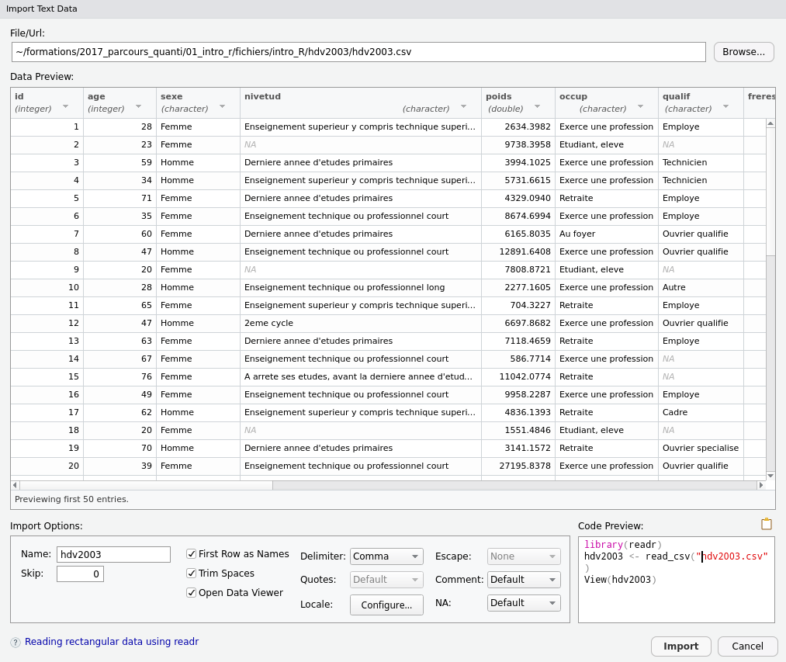

---
output:
  html_document: default
  pdf_document: default
---
# Importer des données externes {#first_import}

Certaines parties de ce chapitre sont extraites du cours de Julien Barnier "Introduction à R et au tidyverse" (https://juba.github.io/tidyverse)

## Import de fichiers csv

R n'est pas prévu pour la saisie de données, mais il bénéficie de nombreuses fonctions et packages permettant l'import de données depuis un grand nombre de formats. Seuls les plus courants seront abordés ici.

<br>

Si votre fichier CSV suit un format CSV standard (c'est le cas s'il a été exporté depuis LibreOffice par exemple), avec des champs séparés par des virgules, vous pouvez utiliser la fonction `read.csv` en lui passant en argument le chemin et le nom du fichier. Cette fonction est issue du package *utils* chargé par défaut à chaque ouverture d'une session RStudio.

```{r, eval=FALSE}
dataset <- read.csv(file = "./Programmation_Statistique_R/dataset/Titanic.csv")
```

Il existe plusieurs variantes à la fonction `read.csv`, la différence réside dans les arguments par défaut. Voir l'aide pour plus d'information :

```{r, eval=FALSE}
help("read.csv")
```

Dans le package *utils*, chaque fonction dispose de plusieurs arguments, parmi lesquels :

- `file` indique le chemin d'accès au fichier
- `header` permet de spécifier si la première ligne correspond aux noms des colonnes
- `sep` indique par quel caractère sont séparées les colonnes ("&#92;t" pour les tabulations)
- `dec` indique par quel caractère joue le rôle de la décimale (. ou ,)
- `row.names` permet de spécifier quel numéro de colonne peut être considéré comme le numéro d'index des lignes
- `na.strings` est un vecteur de chaînes de caractères indiquant les valeurs devant être considérées comme manquantes. Ce vecteur vaut `c("", "NA")` par défaut
- `encoding' permet de gérer l'encodage

<br>

Il peut arriver, notamment sous Windows, que l'encodage des caractères accentués ne soit pas correct au moment de l'importation. On peut alors spécifier manuellement l'encodage avec cet argument

```{r, eval=FALSE}
dataset <- read.csv(file = "C:/Users/anthony.sardellitti/Programmation_Statistique_R/dataset/Titanic.csv",
              header = TRUE, sep = ",", dec = ".",
              row.names = 1, na.strings = c(NA,"NULL","None"),
              encoding = "Latin-1")
```

## Interface interactive d'import de fichiers

RStudio propose une interface permettant d'importer un fichier de données de manière interactive. Pour y accéder, dans l'onglet *Environment*, cliquez sur le bouton *Import Dataset*. On a ensuite le choix du format de fichier qu'on souhaite importer. 

<br>

Attention, selon le format (Excel ou SAS notamment), l'installation de packages pourront être nécessaire. Dans notre exemple, nous importons un fichier CSV, nous avons donc le choix de l'importer avec les fonctions de base que propose le package *utils* où alors avec le package *readr*
L'extension `readr fait partie du *tidyverse* et permet l'importation de fichiers txt, csv, excel mais le nom des fonctions et des arguments sont différents.

<p>

</p>

Sélectionnez *From Text (readr)...*. Une nouvelle fenêtre s'affiche :

<p>

</p>

Il vous suffit d'indiquer le fichier à importer dans le champ *File/URL* tout en haut (vous pouvez même indiquer un lien vers un fichier distant via HTTP). Un aperçu s'ouvre dans la partie *Data Preview* et vous permet de vérifier si l'import est correct :

<p>

</p>

Vous pouvez modifier les options d'importation, changer le type des colonnes, etc. et l'aperçu se met à jour. De même, le code correspondant à l'importation du fichier avec les options sélectionnées est affiché dans la partie *Code Preview*.

**Important** : une fois que l'import semble correct, ne cliquez pas sur le bouton *Import*. À la place, sélectionnez le code généré et copiez-le (ou cliquez sur l'icône en forme de presse papier) et choisissez *Cancel*. Ensuite, collez le code dans votre script et exécutez-le (vous pouvez supprimer la ligne commençant par `View`).
Cette manière de faire permet "d'automatiser" l'importation des données, puisqu'à la prochaine ouverture du script vous aurez juste à exécuter le code en question, sans repasser par l'interface d'import.


## Modifier le répertoire actif

<!-- Etant dans un R Project, les fonctions getwd() et setwd() ne fonctionnent pas. Ainsi pour illustrer les exemples, j'utilise quelques pirouettes -->

La fonction `getwd()` permet d'afficher le répertoire actif. En général, le chemin proposé est similaire à celui ci :

```{r, eval=FALSE}
getwd()
```
```{r, echo=TRUE}
"C:/Users/anthony.sardellitti/Documents"
```

Il est possible de modifier ce chemin. Cela permet notamment d'éviter de saisir le chemin complet d'un fichier de données à l'importation : 

```{r, eval=FALSE}
dataset <- read.csv(file = "C:/Users/anthony.sardellitti/Programmation_Statistique_R/dataset/Titanic.csv")
```

Pour modifier le répertoire courant, on utilise la fonction `setwd()`tel que :

```{r, eval=FALSE}
setwd("C:/Users/anthony.sardellitti/Programmation_Statistique_R/dataset")
```

On observe que le chemin a été modifié :

```{r, eval=FALSE}
getwd()
```
```{r, echo=FALSE}
"C:/Users/anthony.sardellitti/Programmation_Statistique_R/dataset"
```

On peut également faire la même opération en cliquant sur **Session**, puis **Set Working Directory** et **Choose Directory**.

<p>

</p>

Une fois le répertoire actif modifié, on peut aperçevoir que l'onglet *Files* renseigne l'ensemble des fichiers présents dans le répertoire actif :

<p>

</p>

On peut donc importer les fichiers présents dans ce répertoire sans préciser leur chemin.

```{r, eval=FALSE}
dataset <- read.csv(file = "Titanic.csv")
```

Dans la suite de ce livre, le répertoire actif sera :

```{r}
getwd()
```

<p>

</p>

Cela modifiera quelques peu la définition des chemins des fichiers que nous importerons tels que :

```{r, eval=FALSE}
dataset <- read.csv(file = "./dataset/Titanic.csv")
```

## Import depuis un fichier Excel

L'extension `readxl`, qui fait également partie du *tidyverse*, permet d'importer des données directement depuis un fichier au format `xls`ou `xlsx`.

Elle ne fait pas partie du "coeur" du *tidyverse*, il faut donc la charger explicitement avec :

```{r,warning = FALSE}
library(readxl)
```

On peut alors utiliser la fonction `read_excel` en lui spécifiant le nom du fichier :

```{r, eval = FALSE}
dataset <- read_excel(path  = "./dataset/Titanic.xlsx")
```

Il est possible de spécifier la feuille et la plage de cellules que l'on souhaite importer avec les arguments `sheet` et `range` :

```{r, eval = FALSE}
d <- read_excel(path  = "./dataset/Titanic.xlsx", sheet = "Feuil1", range = "A1:G1314")
```

Comme pour l'import de fichiers texte, une interface interactive d'import de fichiers Excel est disponible dans RStudio dans l'onglet *Environment*. Pour y accéder, cliquez sur *Import Dataset* puis *From Excel...*. 

<p>

</p>

Spécifiez le chemin ou l'URL du fichier dans le premier champ, vérifiez l'import dans la partie *Data Preview*, modifiez si besoin les options d'importation, copiez le code d'importation généré dans la partie *Code Preview* et collez le dans votre script.


Pour plus d'informations, voir [le site de l'extension `readxl`](http://readxl.tidyverse.org/).


## Export de données 

### Export de tableaux de données

On peut avoir besoin d'exporter un tableau de données dans R vers un fichier dans différents formats. La plupart des fonctions d'import disposent d'un équivalent permettant l'export de données. On citera notamment :

- `write.csv`, permet d'enregistrer un *data frame* dans un fichier au format texte délimité

Il n'existe par contre pas de fonctions permettant d'enregistrer directement au format `xls` ou `xlsx`. On peut dans ce cas passer par un fichier CSV.

Ces fonctions sont utiles si on souhaite diffuser des données à quelqu'un d'autre, ou entre deux logiciels.

Si vous travaillez sur des données de grandes dimensions, les formats texte peuvent être lents à exporter et importer. Dans ce cas, l'extension `feather` peut être utile : elle permet d'enregistrer un *data frame* au format feather, qui n'est pas le plus compact mais qui est extrêmement rapide à lire et écrire ^[`feather` est un format compatible avec Python, R et Julia. Pour plus d'informations, voir https://github.com/wesm/feather].

Les fonctions `read_feather` et `write_feather` permettent d'importer et exporter des tableaux de données dans ce format.

### Sauvegarder des objets

Une autre manière de sauvegarder des données est de les enregistrer au format `RData`. Ce format propre à R est compact, rapide, et permet d'enregistrer plusieurs objets R, quel que soit leur type, dans un même fichier.

Pour enregistrer des objets, il suffit d'utiliser la fonction `save` et de lui fournir la liste des objets à sauvegarder et le nom du fichier :

```{r, eval = FALSE}
save(... = d, file = "fichier.RData")
```

Pour charger des objets préalablement enregistrés, utiliser `load` :

```{r, eval = FALSE}
load(file = "fichier.RData")
```

Les objets `d`devrait alors apparaître dans votre environnement.

**Attention**, quand on utilise `load`, les objets chargés sont importés directement dans l'environnement en cours avec leur nom d'origine. Si d'autres objets du même nom existaient déjà, ils sont écrasés sans avertissement.


## Exercices

### Sujet

Dans ce qui suit on va utiliser des jeux de données correspondant aux données de tous les vols au départ d’un des trois aéroports de New-York en 2013. La base de données est répartie en plusieurs tables. Nous allons utiliser une d'entres elles pour le moment à savoir le fichier `flights.csv` qui présente 336 776 vols sur 19 variables 
Voici une description de cette table :

- `year`, `month`, `day` : date du vol.
- `dep_time`, `arr_time` : Heures de départ et d'arrivée réelles (format HHMM ou HMM).
- `sched_dep_time`,`sched_arr_time` : Heures de départ et d'arrivée prévues (format HHMM ou HMM).
- `dep_delay`, `arr_delay` : Retards de départ et d'arrivée, en minutes. Les temps négatifs représentent des départs / arrivées précoces.
- `carrier` : Abréviation à deux lettres des compagnies aériennes.
- `flights` : Numéro de vol
- `tailnum` : Immatriculation de l'avion
- `origine`, `dest` : Aéroport de départ et destination.
- `air_time` : Durée du vol en minutes.
- `distance` : Distance entre les aéroports, en miles.
- `hour` , `minute` : Heure de départ prévue divisée en heures et minutes.
- `time_hour` : Date et heure prévues du vol

```{r, echo=FALSE, warning=FALSE, message=FALSE}
library(knitr)
library(dplyr)
library(kableExtra)
library(nycflights13)
taille <- 12
kable(head(flights,n = 20), "html") %>% kable_styling("striped", font_size = taille) %>% scroll_box(width = "100%", height = "400px")
```

**Exercice 1**

a. Importez le jeu de données `fligths.csv`

b. Combien de lignes, colonnes sont présentes dans cette table ?

c. Affichez le nom des colonnes

d. Affichez les 10 premières lignes dans une vue

**Exercice 2**

a. Affichez un résumé des données

b. Affichez le type des colonnes

c. Transformer la variable `flight`en caractère

d. Affichez les quartiles de la distribution de la variable `arr_delay`

e. Affichez les déciles de la distribution de la variable `distance`


**Exercice 3**

a. Quel est l'aéroport avec le plus de départ en 2013 ?

b. Avec la fonction `unique`, affichez le nombre de destinations différentes

c. Proposez une représentation graphique adaptée pour la variable `arr_delay`

d. Proposez une représentation graphique adaptée pour la variable `origin`

e. Proposez une représentation graphique adaptée pour la variable `dest`

f. Même question, mais en affichant uniquement un top 10


### Correction

**Exercice 1**

a. Importez le jeu de données `fligths.csv`. Attention, en réalité ce jeu de données est issu du package *nycflights13*

```{r}
flights <- read.csv(file = "./dataset/flights.csv", sep = "\t")
```

b. Combien de lignes, colonnes sont présentes dans cette table ?

```{r}
dim(x = flights)

#ou

ncol(x = flights) ; nrow(x = flights)
```


c. Affichez le nom des colonnes

```{r}
colnames(x = flights) #fonctionne aussi avec names(flights)
```

d. Affichez les 10 premières lignes dans une vue

```{r, eval=FALSE}
View(head(x = flights, n = 10))
```


**Exercice 2**

a. Affichez un résumé des données

```{r, eval= FALSE}
summary(object = flights)
```

b. Affichez le type des colonnes

```{r, eval=FALSE}
str(flights)
```


c. Transformer la variable `flight`en caractère

```{r}
flights$flight <- as.character(x = flights$flight)
class(x = flights$flight )
```

d. Affichez les quartiles de la distribution de la variable `arr_delay`

```{r}
#Attention aux valeurs manquantes
quantile(x = flights$arr_delay, na.rm = TRUE)
```

e. Affichez les déciles de la distribution de la variable `distance`

```{r}
quantile(x = flights$distance, probs = seq(0,1,0.1))
```

**Exercice 3**

a. Quel est l'aéroport avec le plus de départ en 2013 ?

```{r}
table(x = flights$origin)
```

b. Avec la fonction `unique`, affichez le nombre de destinations différentes

```{r}
length(x = unique(x = flights$dest))
```

Si la variable `dest` est de type `factor`, on peut simplement compter le nombre de `levels`

```{r}
is.factor(flights$dest) 
length(levels(flights$dest))
```

c. Proposez une représentation graphique adaptée pour la variable `arr_delay`

```{r, fig.width= 12, fig.height=4}
boxplot(x = flights$arr_delay, horizontal = TRUE, 
        main = "Répartition des retards (en minutes)")
```

d. Proposez une représentation graphique adaptée pour la variable `origin`

```{r, fig.width= 12, fig.height=4}
count <- table(flights$origin)
pie(x = count, main = "Répartition des vols depuis l'aéroport de départ",
    labels = paste(row.names(count),"\n",count),col = colors())
```

e. Proposez une représentation graphique adaptée pour la variable `dest`

```{r, fig.width= 12, fig.height=4}
count <- sort(x = table(flights$dest),decreasing = TRUE)
barplot(height = count, main = "Nombre de vols pour chaque destination",
        las = 2, cex.names = 0.4)
```

f. Même question, mais en affichant uniquement un top 10

```{r, fig.width= 12, fig.height=4}
count <- sort(x = table(flights$dest),decreasing = TRUE)[1:10]
barplot(height = count, main = "Nombre de vols pour chaque destination \n TOP 10",
        ylim = c(0,20000), col = "blue")
```


## Testez vos connaissances !

<p>

</p>

Testez vos connaissances sur ce chapitre avec ce quiz (10 min) en [cliquant ici](https://kahoot.it/challenge/04969962?challenge-id=93264293-c5c0-4eb8-8381-2ba18c649ca3_1616285433835).
