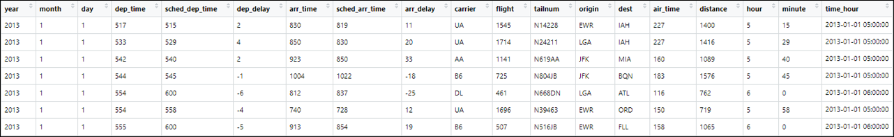

# Manipulation des objets {#manipulation_objet}

## Liste

Un vecteur, est une liste d'élément de même type. À l'inverse, une liste est une collection d’objets de différentes classes.
La fonction `list` permet de créer une liste.

```{r}
ma_liste <- list(matrix(data = 1:10, nrow = 2),
                "Hello world",
                c("Pierre","Paul","Jacques"))
ma_liste
```

Pour accéder à un objet d'une liste, on utilise des doubles crochets : par exemple [[ 1 ]] pour le premier objet d’une liste.

```{r}
ma_liste[[1]]
```


On peut accéder aux objets d'une liste avec le `$`lorsque les objets ont des noms. Les noms peuvent être définis lors de la création de la liste ou avec la fonction `names`.

```{r}
ma_liste <- list(obj1 = matrix(data = 1:10, nrow = 2),
                obj2 = "Hello world",
                obj3 = c("Pierre","Paul","Jacques"))

ma_liste$obj1
```

```{r}
names(ma_liste) <- c("matrice", "element", "vecteur")
ma_liste
```


Comme pour les vecteurs, la fonction `length' retourne la longueur d'une liste.

```{r}
length(ma_liste)
```

Pour supprimer un objet d'une liste, on lui affecte la valeur `NULL`

```{r}
ma_liste$matrice <- NULL
ma_liste
```

Pour ajouter un objet à une liste, on affecte un objet à au nom du nouvel objet de la liste qui n'existe pas.

```{r}
ma_liste$matrice2 <- matrix(data = 1:10, nrow = 2)
ma_liste
```


## Matrice

On sait que qu'on peut accéder à un élément particulier d'un vecteur en faisant suivre le nom du vecteur de crochets contenant le numéro de l'élément désiré. Par exemple :

```{r}
a <- c(1,5,6,9)
a[2]
```

Cette opération, qui utilise l'opérateur `[]`, permet donc la sélection d'éléments d'un vecteur.

Dans un objet à deux dimensions comme les matrices,

```{r}
a <- matrix(data = 1:9, nrow = 3,
            dimnames =  list(c("ligne1","ligne2","ligne3"),
                            c("col1","col2","col3")))
class(a)
a
```

on utilise la même syntaxe sauf qu'on précise les index lignes et colonnes entre `[]` séparés par une virgule.

```{r}
#accéder à l'élément de la 2ème ligne et 3ème colonne
a[ 2 , 3]

#accéder à la deuxième ligne
a[ 2 , ]

#accéder à la troisième colonne
a[ , 3 ]

```

On peut également effectuer une indexation multiple sur les matrices si on souhaite sélectionner plusieurs lignes et colonnes.

```{r}
a[ , c(1,3)]
```

```{r}
a[c(2,3) , ]
```

```{r}
a[c(2,3) , c(1,3) ]
```

**Attention** : Lorsqu'on effectue une indexation multiple, le résultat renvoyé est dans l'ordre des index précisés dans le vecteur. Nous aborderons de nouveau cette notion lors des tris.

```{r}
a[c(3,2) , c(2,3,1) ]
```


On peut également effectuer une indexation *contraire* sur les matrices en précisant toutes les lignes / colonnes que l'on ne veut pas sélectionner. Pour cela, on utilise le '-' devant l'indexation :

```{r}
a[ , -2 ]
```

```{r}
a[- c(2,3) , ]
```

**Attention** : dans une matrice, tous les éléments sont de même type `numeric`, `character` ou `logique`. C'est pourquoi, on travaille avec une autre classe d'objet pour les jeux de données. La classe `data.frame`.


## Data frame

La classe d'objet `data.frame` partage les mêmes propriétés que la classe `matrix` pour l'indexation. Un data frame c'est une collection de vecteurs de même taille stockés dans un objet à deux dimensions. Autrement dit, dans un data frame, chaque colonne est un vecteur avec son propre type (numeric, character, factor, logical, date, etc.). Dans cette partie nous allons voir comment manipuler un `data.frame` sans utiliser le package *dplyr*. 

### Indexations simples

Un des plus de la classe `data.frame` c'est la possibilité d'indexer les lignes et les colonnes avec leur nom.

```{r}
a
class(a)
```

```{r, error = TRUE}
a$col1
```

```{r}
b <- as.data.frame(x = a)
class(b)
```

```{r}
b$col1
```

```{r}
b[ c("ligne1"), c("col2","col1")]
```


### Indexations avec des booléens

Dans le langage R, il est possible d'effectuer des indexations sur des objets avec des booléens `TRUE` / `FALSE`. 

Dans l'exemple ci-dessous, je vais indexer le vecteur avec un vecteur logique de même taille

```{r}
a <- c(4,2,6,9,7)

#afficher le 2ème et 4ème éléments
a[c(FALSE,TRUE,FALSE,TRUE,FALSE)]
```


Dans un data frame, on peut utiliser ce procédé pour sélectionner certaines lignes et colonnes :

```{r}
b
```

```{r}
#accéder à la 2ème ligne
b [ c(FALSE,TRUE,FALSE),  ]
```

```{r}
#accéder à la 3eme colonne
b [ , c(FALSE,FALSE,TRUE) ]
```

```{r}
#accéder à l'élément de la 2ème ligne et 3ème colonne
b [ c(FALSE,TRUE,FALSE), c(FALSE,FALSE,TRUE) ]
```

Ainsi, avec des vecteurs logiques, il est possible d'indexer des `data.frame`. C'est ce mécanisme qui permet d'effectuer des filtres.

### Filtre et sélection dans un data frame

Pour filtrer un `data.frame`, il suffit d'insérer un ou plusieurs tests logiques dans l'indexation de l'objet. Pour rappel, les tests logiques retournent toujours des valeurs logiques `TRUE` / `FALSE`.

```{r}
a <- c(1,9,7,1,6)
a > 5
```

```{r}
b
```

```{r}
b[ b$col1 > 1 , ]
```

```{r}
b[ (b$col1 > 1) & (b$col2 < 6) , ]
```


### Exercices

#### Sujet

Pour illustrer ces notions, on utilise la base de données correspondant aux informations de tous les vols au départ d’un des trois aéroports de New-York en 2013. La base de données est répartie en 5 tables et disponible à partir du package *nycflights13*.

```{r, warning = FALSE}
#on charge le package
library(nycflights13)

#on affiche les objets disponibles du package
ls("package:nycflights13")
```

Nous allons utiliser la table `flights` qui présente 336 776 vols sur 19 variables 
Voici une description de cette table :

- `year`, `month`, `day` : date du vol.
- `dep_time`, `arr_time` : Heures de départ et d'arrivée réelles (format HHMM ou HMM).
- `sched_dep_time`,`sched_arr_time` : Heures de départ et d'arrivée prévues (format HHMM ou HMM).
- `dep_delay`, `arr_delay` : Retards de départ et d'arrivée, en minutes. Les temps négatifs représentent des départs / arrivées précoces.
- `carrier` : Abréviation à deux lettres des compagnies aériennes.
- `flights` : Numéro de vol
- `tailnum` : Immatriculation de l'avion
- `origine`, `dest` : Aéroport de départ et destination.
- `air_time` : Durée du vol en minutes.
- `distance` : Distance entre les aéroports, en miles.
- `hour` , `minute` : Heure de départ prévue divisée en heures et minutes.
- `time_hour` : Date et heure prévues du vol


<p>

</p>

**Exercice 1**

a. Installez, puis chargez le package *nycflights13*

b. Combien de lignes, colonnes sont présentes dans cette table ?

c. Affichez le nom des colonnes

d. Affichez un résumé des données

**Exercice 2**

a. Sélectionnez uniquement les colonnes `year`, `month`, `day`.

b. Sélectionnez uniquement les colonnes 13 à 19.

c. Sélectionnez toutes colonnes sauf `dep_delay` et `arr_delay`.

**Exercice 3**

Pour répondre aux questions, utilisez des tests logiques **sans** passer par la fonction `subset`.

a. Filtrez la table en sélectionnant les vols du mois de janvier.

b. Filtrez la table en sélectionnant les vols en provenance de `LGA` et `JFK`.

c. Filtrez la table en sélectionnant les vols avec 10 à 30 min de retards à l'arrivée.

d. Filtrez la table en sélectionnant les vols avec 10 à 30 min de retard à l'arrivée du mois de janvier.

#### Correction

**Exercice 1**

a. Installez, puis chargez le package *nycflights13*

```{r, warning = FALSE}
library(nycflights13)
```

b. Combien de lignes, colonnes sont présentes dans cette table ?

```{r}
dim(x = flights)
```

c. Affichez le nom des colonnes

```{r, eval=FALSE}
colnames(x = flights)
```

d. Affichez un résumé des données

```{r, eval=FALSE}
summary(object = flights)
```

**Exercice 2**

a. Sélectionnez uniquement les colonnes `year`, `month`, `day`.

```{r}
requeteA <- flights[ , c("year", "month", "day") ]
dim(requeteA)
```

b. Sélectionnez uniquement les colonnes 13 à 19.

```{r}
requeteB <- flights[ , 13:19 ]
dim(requeteB)
```

c. Sélectionnez toutes colonnes sauf `dep_delay` et `arr_delay`.

On utilise un test logique sur le nom des colonnes

```{r}
colnames(flights)
```

```{r}
colnames(flights) %in% c('dep_delay','arr_delay')
```

```{r}
requeteC <- flights[ , colnames(flights) %in% c('dep_delay','arr_delay') ]
dim(requeteC)
```

**Exercice 3**

Pour répondre aux questions, utilisez des tests logiques **sans** passer par la fonction `subset`.

a. Filtrez la table en sélectionnant les vols du mois de janvier.

```{r}
requeteA <- flights[ flights$month == 1 , ]
dim(requeteA)
```

b. Filtrez la table en sélectionnant les vols en provenance de `LGA` et `JFK`.

```{r}
requeteB <- flights[ flights$origin %in% c("JFK","LGA") , ]
dim(requeteB)
```

c. Filtrez la table en sélectionnant les vols avec 10 à 30 min de retards à l'arrivée.

```{r}
requeteC <- flights[ (flights$arr_delay > 10) & 
                       (flights$arr_delay < 30) &
                       (!is.na(flights$arr_delay)), ]
dim(requeteC)
```

d. Filtrez la table en sélectionnant les vols avec 10 à 30 min de retard à l'arrivée du mois de janvier.

```{r}
requeteD <- flights[ (flights$arr_delay > 10) &
                       (flights$arr_delay < 30) &
                       (!is.na(flights$arr_delay)) &
                       (flights$month == 1)  , ]
dim(requeteD)
```


### Trier un data frame

On sait que la fonction `sort` permet de trier un vecteur.

```{r}
a <- c(1,9,4,6)
sort(x = a, decreasing = TRUE)
```

La fonction `order` permet de trier un vecteur à partir des rangs.

```{r}
a <- c(1,9,4,6)
order(a,decreasing = TRUE)
```

On utilise ensuite le vecteur avec les rangs pour trier le vecteur

```{r}
a[ order(a,decreasing = TRUE) ]
```

Pour trier un data frame ou une matrice, on utilise le même procédé avec la fonction `order`.

```{r}
a <- matrix(data = c(1,4,4,0,7,9,2,5,6), nrow = 3,
            dimnames =  list(c("ligne1","ligne2","ligne3"),
                            c("col1","col2","col3")))
a
```

Ici, on souhaiter trier la matrice selon la deuxième colonne avec un tri décroissant. Seule, la fonction `order` renvoie les rangs dans lesquels il faudrait trier le tableau.

```{r}
order(a[,2],decreasing = TRUE)
```

Il faut utiliser ce vecteur de rang dans l'indexation de la matrice pour la trier.

```{r}
rang <- order( a[,2],decreasing = TRUE )
a[ rang , ]
```

On peut aussi utiliser le '-' devant le vecteur à trier pour effectuer un tri décroissant.

```{r}
rang <- order( - a[,2] )
a[ rang , ]
```


C'est cette syntaxe qu'on retrouve pour réaliser des tris successifs, on utilise toujours la fonction `order` avec chaque vecteur comme argument.
On souhaite trier la première colonne par ordre croissant puis la deuxième colonne par ordre décroissant :

```{r}
rang <- order(a[,1] , - a[,2] )
a[ rang , ]
```

### Exercice

#### Sujet

Nous utilisons toujours la table `flights`. Pour faciliter la lecture des résultats des requêtes, n'affichez que :

* les 5 premières lignes
* la colonne `flight`, `tailnum` et celles avec le(s) tri(s) concerné(s)

**Exercice 1**

a. Trier la table selon le mois du vol

b. Trier la table selon les vols avec le plus de retard à l'arrivée

c. Trier la table par vols de provenance, puis de destination

#### Correction

**Exercice 1**

a. Trier la table selon le mois du vol

```{r, echo = FALSE,warning=FALSE}
#On charge la librairie knitr pour utiliser la fonction kable pour les tableaux en sortie
library(knitr)
```


```{r}
rang <- order(flights$month)
requeteA <- flights[ rang , c("flight", "tailnum", "month") ]
```

```{r, echo=FALSE}
kable(head(x = requeteA, n = 5) )
```

b. Trier la table selon les vols avec le plus de retard à l'arrivée

```{r}
rang <- order(-flights$arr_delay)
requeteB <- flights[ rang , c("flight", "tailnum", "arr_delay") ]
```

```{r, echo=FALSE}
kable( head(x = requeteB, n = 5) )
```


c. Trier la table par vols de provenance, puis de destination

```{r}
rang <- order(flights$origin, flights$dest)
requeteC <- flights[ rang , c("flight", "tailnum", "origin", "dest") ]
```

```{r, echo=FALSE}
kable( head(x = requeteC, n = 5) )
```

### Agréger des données

Le langage R permet aussi d'effectuer des opérations groupées en effectuant des agrégations.
Pour cela on utilise la fonction `aggregate`.
Il faut préciser dans la fonction le champ avec lequel on souhaite grouper les données, puis la fonction d'agrégation à utiliser.

Ici, on calcule le retard moyen au départ pour chaque aéroport d'origine :

```{r}
agregation <- aggregate(formula = dep_delay ~ origin, data = flights , FUN = mean)
```

```{r, echo=FALSE}
kable(head(agregation))
```


On peut également grouper les données selon plusieurs champs qu'on renseigne avec le '+' dans l'argument `formula.`
Ici on calcule le retard moyen au départ pour chaque aéroport d'origine et chaque mois :

```{r}
agregation <- aggregate(formula = dep_delay ~ origin + month, 
                         data = flights , FUN = mean)
```


```{r, echo=FALSE}
kable(head(agregation))
```


Le raccourci '**.**' dans l'argument `formula` permet d'agréger toutes les colonnes en fonction '**~**' d'une ou plusieurs.

```{r}
agregation <- aggregate(formula = . ~ origin, 
                         data = flights[ , c("origin","dep_delay","arr_delay","distance")],
                         FUN = mean)
```

```{r, echo=FALSE}
kable(head(agregation))
```


### Exercice

#### Sujet

**Exercice 1**

a. Calculez le retard maximum au départ de chaque aéroport

b. Calculez l'écart-type sur les retards au départ et l'arrivée pour chaque aéroport d'origine

c. Calculez le nombre de vols par aéroport d'origine

#### Correction

a. Calculez le retard maximum au départ de chaque aéroport

```{r}
agregationA <- aggregate(formula = dep_delay ~ origin, data = flights, FUN = max)
```

```{r, echo=FALSE}
kable(agregationA)
```


b. Calculez l'écart-type sur les retards au départ et l'arrivée pour chaque aéroport d'origine

```{r}
agregationB <- aggregate(formula = . ~ origin, 
                         data = flights[ , c("origin","dep_delay", "arr_delay")],
                         FUN = sd)
```

```{r, echo=FALSE}
kable(agregationB)
```


c. Calculez le nombre de vols par aéroport d'origine

```{r}
agregationC <- aggregate(formula = tailnum ~ origin, 
                         data = flights,
                         FUN = length)
```

```{r, echo=FALSE}
kable(agregationC)
```


## Testez vos connaissances !

<p>

</p>

Testez vos connaissances sur ce chapitre avec ce quiz (10 min) en [cliquant ici](https://kahoot.it/challenge/04054859?challenge-id=93264293-c5c0-4eb8-8381-2ba18c649ca3_1616285367955).
