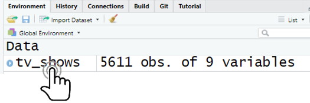

# R-Express 30' ☕ {#express}

Il est peut être intéressant d'aborder ce chapitre en amont d'une formation Nous présentons ici comment être opérationnel sur R en quelques clics et surtout sans connaissance du langage ! Attention tout de même, vous ne pourrez pas faire illusion bien longtemps car il faudra revenir au fondamentaux du langage pour aller plus loin. Ici nous allons à droit au but. 30' Top chrono !

## Aller hop ! Importez des données

RStudio propose une interface permettant d'importer un fichier de données de manière interactive. Pour y accéder, dans l'onglet *Environment*, cliquez sur le bouton *Import Dataset*. On a ensuite le choix du format de fichier qu'on souhaite importer. 

<p>

</p>

Sélectionnez *From Text (base)...*. Une nouvelle fenêtre s'affiche :

<p>

</p>

Il vous suffit d'indiquer le fichier à importer dans le champ *File/URL* tout en haut (vous pouvez même indiquer un lien vers un fichier distant via HTTP). Importez le fichier `tv_shows.csv` qui décrit les notes d'évaluation des films et séries disponibles sur diverses plateformes de diffusion en continu. Un aperçu s'ouvre dans la partie *Data Preview* et vous permet de vérifier si l'import est correct. Le champ *Name* qui est modifiable correspondra au nom de votre tableau dans RStudio. Cliquez ensuite sur *Import*. RStudio vous propose une vue de votre tableau.

<p>

</p>

## Manipulez votre tableau

### Dans une vue

Après l'importation, vous pouvez accéder à la vue de votre tableau en cliquant sur votre objet dans la fenêtre d'environnement

<p>

</p>

Vous pouvez ensuite effectuer des tris et des filtres en naviguant sur la vue. Dans l'exemple ci-dessous nous avons filtré sur l'année 2019, filtré les films disponibles sur Netflix et trié selon la note des utilisateurs en colonne `IMDb`. 

<p>

</p>

### Avec `dplyr`

Bon le problème de manipuler un tableau dans une vue est qu'on ne peut pas le modifier.
Pour cela, nous allons commencer à coder en R avec un package qui nous facilite la vie. Mais c'est quoi un package ?
R étant un logiciel libre, il bénéficie d'un développement communautaire riche et dynamique. L'installation de base de R permet de faire énormément de choses, mais le langage dispose en plus de packages permettant d'ajouter facilement de nouvelles fonctionnalités. La plupart des packages sont développées et maintenues par la communauté des utilisateurs de R, et diffusées via un réseau de serveurs nommé CRAN (*Comprehensive R Archive Network*).

Pour installer un package, si on dispose d'une connexion Internet, on peut utiliser le bouton *Install* de l'onglet *Packages* de RStudio. 

<p>

</p>

Renseignez le nom du package `dplyr` dans le champ concerné puis cliquez sur *Install*.

<p>

</p>

Cela peut durer quelques secondes. Voilà, vous avez enfin le package `dplyr` dans la liste des packages déjà installés. Nous n'aurons plus à réitérer cette opération les prochaines fois.

Nous allons maintenant créer un script pour que toutes nos commandes soient sauvegardées et réutilisables. Pour créer un script, il suffit de sélectionner le menu *File*, puis *New file* et *R script* ou tout simplement utiliser le raccourci `Ctrl + Shift + N`.

<br>

Voici la première commande que nous allons saisir. Même si le package `dplyr` est déjà installé, il faut que RStudio le charge en mémoire. Écrivez cette ligne dans votre script :

```{r, echo=FALSE, warning=FALSE, message=FALSE}
library(knitr)
library(kableExtra)
library(dplyr)
taille <- 12
```

```{r, warning=FALSE, message=FALSE}
library(dplyr)
```

Vous avez écrit une ligne de commande mais il faut encore l'exécuter. Pour cela, sélectionnez votre code à exécuter puis cliquer sur le bouton *Run* dans la barre d'outils juste au-dessus de la zone d'édition du script. On peut aussi utiliser le raccourci clavier `Ctrl + Entrée`. On peut désormais utiliser les fonctionnalités du package `dplyr`.

### Sélectionner certaines colonnes

La fonction `select` permet de sélectionner certaines colonnes d'un tableau.
On va construire un nouveau tableau appelé *tv_shows_select* avec uniquement les colonnes *Title*, *Year*, *Age* et *IMDb*.

```{r, echo=FALSE}
tv_shows <- read.csv("./dataset/tv_shows.csv")
```


```{r}
tv_shows_select <- select(tv_shows, Title, Year, Age, IMDb)
```

```{r, echo=FALSE, warning=FALSE, message=FALSE}
kable(head(tv_shows_select,n = 20), "html") %>% kable_styling("striped", font_size = taille) %>% scroll_box(width = "100%", height = "200px")
```

Votre nouveau tableau apparaît dans la fenêtre *Environnement*.

### Ajouter des filtres

La fonction `filter` permet de construire des filtres. On va construire un nouveau tableau appelé *tv_shows_filter* en partant du tableau précédent. On ajoute un filtre sur la variable `Year` en ne conservant que les films de 2019.

```{r}
tv_shows_filter <- filter(tv_shows_select, Year == 2019)
```

```{r, echo=FALSE, warning=FALSE, message=FALSE}
kable(head(tv_shows_filter,n = 20), "html") %>% kable_styling("striped", font_size = taille) %>% scroll_box(width = "100%", height = "200px")
```

### Trier un tableau

La fonction `arrange` permet de construire des filtres. On va construire un nouveau tableau appelé *tv_shows_sort* en partant du tableau précédent. On tri les films de la meilleure note `IMDb` à la plus mauvaise.

```{r}
tv_shows_sort <- arrange(tv_shows_filter, desc(IMDb))
```

```{r, echo=FALSE, warning=FALSE, message=FALSE}
kable(head(tv_shows_sort,n = 20), "html") %>% kable_styling("striped", font_size = taille) %>% scroll_box(width = "100%", height = "200px")
```


Après ces 3 opérations `select`, `filter` et `arrange`, vous devez avoir ces tableaux dans votre environnement.

<p>

</p>


## Des graphiques en 3 clics avec `esquisse`


Le package `esquisse` permet de construire des graphiques en quelques clics.
Il faut aussi installer ce package, cette fois-ci on le fait directement en exécutant une seule et unique fois cette commande dans le script :

```{r, eval=FALSE}
install.packages("esquisse")
```

```{r, echo=FALSE, warning=FALSE, message=FALSE}
library(esquisse)
```

Voilà, puis executer ces commandes :

```{r, eval=FALSE}
library(esquisse)
esquisser(tv_shows_sort)
```

Une fenêtre s'ouvre dans lequel vous pouvez construire quelques graphiques, les personnalisés et les exporter avec le code associé.

<p>

</p>

## En bref 

Nous avons vu dans ce chapitre comment être opérationnel très rapidement sur R avec des commandes pratiques et faciles. Néanmoins, cela n'est pas suffisant pour aller plus loin. Ce cours vous fournira une base théorique permettant d'être autonome par la suite.
