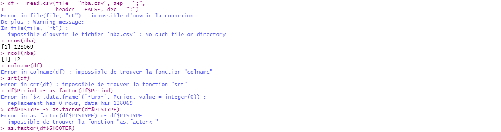
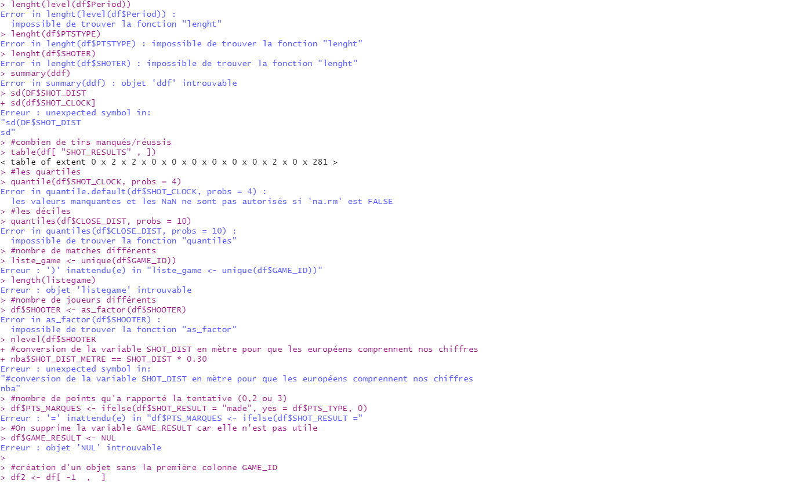
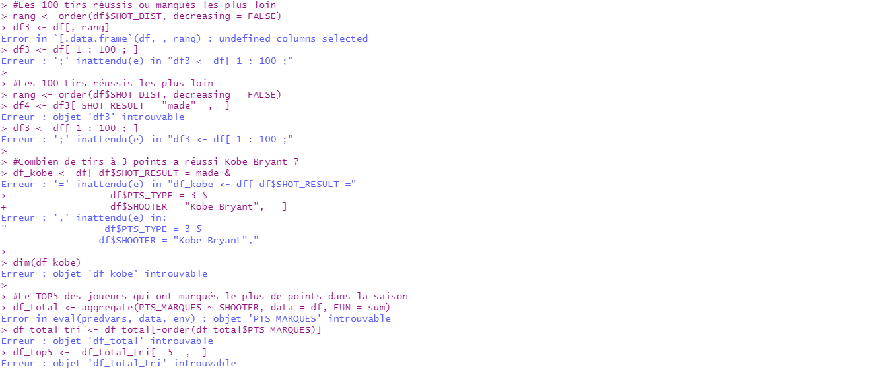
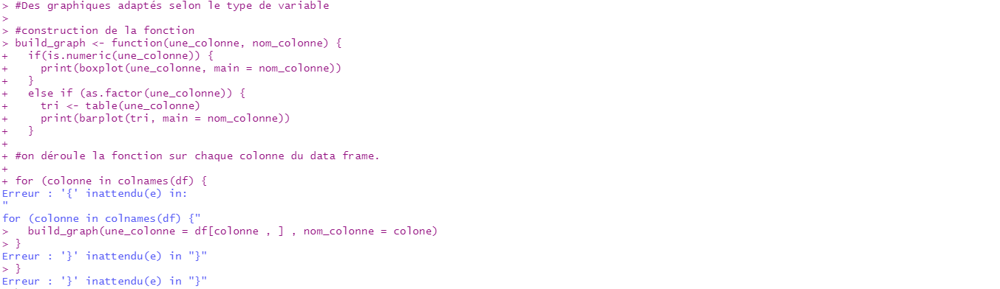

# S'entrainer {#entrainement}

## TP1

**Difficulté 🏆**

```{r, echo=FALSE, warning=FALSE, message=FALSE}
library(readxl)
library(dplyr)
library(knitr)
library(kableExtra)
taille <- 12
```

Ce TP reprend les notions évoquées dans les chapitres 2 et 3.
On utilise  le dataset `mtcars` qui décrit les statistiques de voitures.
Le dataset est présent dans le package *datasets* automatiquement installé sur R. Voici une description des données :

-	`mpg`	: Miles/(US) gallon
-	`cyl`	: Number of cylinders
-	`disp` :	Displacement (cu.in.)
-	`hp` :	Gross horsepower
-	`drat` :	Rear axle ratio
-	`wt` :	Weight (1000 lbs)
-	`qsec` :	1/4 mile time
-	`vs` :	Engine (0 = V-shaped, 1 = straight)
-	`am` :	Transmission (0 = automatic, 1 = manual)
-	`gear` :	Number of forward gears
-	`carb` :	Number of carburetors

```{r, echo=FALSE, warning=FALSE, message=FALSE}
df <- mtcars
kable(head(df,n = 10), "html") %>% kable_styling("striped", font_size = taille) %>% scroll_box(width = "100%", height = "400px")
```

<br>

**Exercice 1 : Préparer son environnement de travail**

a. Dupliquer le dataset dans un nouvel objet appelé `df`.
b. Combien de lignes, colonnes sont présentes dans ce dataset (utilisez les fonctions adaptées) ?
c. Affichez le nom des colonnes
d. Affichez le type des colonnes avec la fonction adaptée.
e. On souhaite analyser les variables `cyl`, `vs`, `am`, `gear` et `carb` en tant que variables qualitatives. Modifier le type de ces variables pour les transformer en type factor.
f. Combien de niveaux (*levels*) sont présents dans ces variables ?
g. Affichez un résumé des données avec la fonction adaptée.

**Exercice 2 : Statistiques descriptives**

a. Déterminer la moyenne de la variable `mpg`
b. Déterminer le maximum la variable `wt`.
c. Déterminer la médiane de la variable `hp`.
d. Déterminer les quartiles de la variable `qsec`.
e. Déterminer les déciles de la variable `qsec`.
f. Déterminer la variance et l'écart-type de la variable `qsec`.
g. Déterminer un tri à plat pour compter les effectifs des modalités de chaque variables *factor*.

**Exercice 3 : Quelques graphiques**

a. Contruire un histogramme de la distribution de la variable `qsec`.
b. Constuire une boîte à moustache de la distribution de la variable `qsec`.
c. Construire un diagramme en barre de répartition de la variable `carb`.
d. Construire un diagramme circulaire de la répartition de la variable `vs`.

**Exercice 4 : Création de nouvelles colonnes**

a. La colonne `mpg` correspond au nombre de miles parcouru en 1 gallon (US). Cette mesure correspond en quelques sortes à la mesure de consommation de litres aux 100 km utilisée en France. Créer une colonne supplémentaire appelée `litres_au_100km` qui correspond à la conversion de la variable `mpg`(Miles/(US) gallon) en nombre de litres aux 100 kilomètres. Aidez-vous du guide des conversion disponible sur ce [lien](https://anglais-pratique.fr/index.php/rubriques/divers/101-mpg-l-100km).
b. Construire une nouvelle colonne appelée `qsec_cut` qui est un découpage de la variable `qsec` en 3 groupes (pas de restriction sur le nombre de classe).
c. Construire une nouvelle colonne appelée `litres100km_group` pour distinguer deux groupes de voiture : celles qui consomment plus que la moyenne et celles qui consomment moins que la moyenne.

## TP2

**Difficulté 🏆🏆**

<p>

</p>

Ce TP reprend les notions évoquées dans les chapitres 2 à 5.
On utilise  le fichier `pokemon.xlsx` qui décrit les statistiques des pokemon des deux premières générations.
Le fichier est issu du site [ Kaggle ](https://www.kaggle.com/rounakbanik/pokemon). Il a été adapté pour ce TP. Pour réaliser ce TP, télécharger le fichier en [cliquant ici](https://github.com/asardell/programmation-r/tree/master/dataset).Voici une description des données :

- `pokedex_number` : numéro du pokemon
- `nom` : nom du pokemon
- `generation` : le numéro de génération dont est issu le pokemon
- `is_legendary` : Oui / Non si le pokemon est légendaire
- `type` : le type du pokemon
- `weight_kg` : le poids du pokemon en kg
- `height_m` : la taille du pokemon en mètre
- `attack` : la puissance d'attaque du pokemon
- `defense` : la puissance de défense du pokemon
- `speed` : la vitesse du pokemon


```{r, echo=FALSE, warning=FALSE, message=FALSE}
library(readxl)
pokemon <- read_excel(path = "./dataset/pokemon.xlsx", sheet = "pokemon")
kable(head(pokemon,n = 20), "html") %>% kable_styling("striped", font_size = taille) %>% scroll_box(width = "100%", height = "400px")
```
<br>

**Exercice 1 : Importer les données**

a. Importez le jeu de données `pokemon.xlsx` à l'aide du package `readxl`.
b. Combien de lignes, colonnes sont présentes dans ce dataset (utilisez les fonctions adaptées) ?
c. Affichez le nom des colonnes.
d. Affichez le type des colonnes avec la fonction adaptée.
e. On souhaite analyser les variables `generation`, `is_legendary`, et `type` en tant que variables qualitatives. Modifier le type de ces variables pour les transformer en type factor.
f. Combien de niveaux (*levels*) sont présents dans ces variables ?
g. Affichez un résumé des données avec la fonction adaptée.


**Exercice 2 : Statistiques descriptives**

a. Déterminer la moyenne de la variable `weight_kg`.
b. Déterminer la médiane de la variable `weight_kg`.
d. Déterminer les quartiles de la variable `height_m`.
e. Déterminer les déciles de la variable `height_m`.
f. Déterminer la variance et l'écart-type de la variable `weight_kg`.
g. Déterminer un tri à plat pour compter les effectifs des modalités de chaque variable *factor* en triant chaque sortie par ordre décroissant.

**Exercice 3 : Tris et Selections**

Pour chaque question suivante, affectez le résultat de la requête dans un objet puis calculez sa dimension. Exemple :

```{r}
#Selectionnez les deux premières colonnes du data frame
requete_0 <- pokemon[,1:2]
dim(requete_0)
```

a. Sélectionnez la colonne `nom` et `is_legendary`.
b. Sélectionnez les 50 premières lignes et les deux premières colonnes.
c. Sélectionnez les 10 premières lignes et toutes les colonnes.
d. Sélectionnez toutes les colonnes sauf la dernière.
e. Sélectionnez les colonnes 2,8,9 et 10.
f. Sélectionnez les lignes 20 à 30 et 80 à 100.
g. Triez le dataset  par ordre alphabétique et afficher le `nom` du pokemon dela première ligne.
h. Triez le dataset  par `weight_kg` en ordre **décroissant**, et afficher le `nom`du pokemon de la première ligne
i. Triez le dataset  par `attack` en ordre **décroissant** puis par `speed` en ordre **croissant**, et afficher le `nom` des pokemons des 10 premières lignes.


**Exercice 4 : Tris et Filtres**

Pour chaque question suivante, affectez le résultat de la requête dans un objet puis calculez sa dimension. Pour faciliter la lecture, sélectionnez la colonne `nom`et les colonnes concernées par le filtre. Exemple :

```{r}
#Selectionnez les pokemons de type feu
requete_0 <- pokemon[ pokemon$type == "fire", c("nom","type")]
dim(requete_0)
```
a. Filtrez sur les pokemons qui ont 150 ou plus d'`attack` puis trier le résultat par ordre décroissant d'`attack`. 
b. Filtrez sur les pokemons de `type` *dragon*,*ghost*,*psychic* et *dark*
c. Filtrez sur les pokemons de `type` *fire* avec plus de 100 d'`attack`, puis trier le résultat par ordre décroissant d'`attack`. 
d. Filtrez sur les pokemons qui ont entre 100 et 150 de `speed`. Les trier par `speed` décroissant.
e. Filtrez sur les pokemons pesant plus de 250 kg et affichez le résultat pour vérifier.
f. Filtrez sur les pokémons qui ont des valeurs manquantes sur la variable `height_m`.
g. Filtrez sur les pokemons qui ont des valeurs renseignées à la fois pour la variable `weight_kg` **et** la variable `height`.


**Exercice 5 : Agregations**

Pour chaque question suivante, affectez le résultat de la requête dans un objet puis calculez sa dimension. Exemple :

```{r}
#Calculez la vitesse moyenne par generation
requete_0 <- aggregate(x = speed ~ generation, data = pokemon , FUN = mean)
dim(requete_0)
```

```{r, echo=FALSE}
kable(requete_0)
```

a. Calculez l'`attack` moyenne en fonction de la variable `type`, puis filtrez sur les 3 types avec les moyennes les plus élevées.
b. Calculez le nombre de pokemon par `type` , puis triez par ordre décroissant ces effectifs.
c. Calculez la médiane de `weight_kg` par `type`.
d. Calculez le nombre de pokemon par `type` et `generation`
e. Calculez la moyenne de chaque critère (`weight_kg`, `height_m`, `attack`, `defense` et `speed`) en fonction de chaque `type`.

## TP3

**Difficulté 🏆🏆🏆**

<p>

</p>

Ce TP reprend les notions évoquées dans les chapitres 6,7 et 10.
On utilise le fichier compressé `AmongUs.7z` où l'ensemble des fichiers décrivent les statistiques des parties jouées sur le jeu *Among Us*. Il y a un fichier par joueur nommé *UserX.csv*.
Les données sont issues du site [Kaggle](https://www.kaggle.com/ruchi798/among-us-dataset). Pour réaliser ce TP, télécharger le fichier en [cliquant ici](https://github.com/asardell/programmation-r/tree/master/dataset).
Les fichiers csv ont tous la même structure avec :

- `Game.Completed.Date` : Date de la partie
- `Team` : l'équipe attribuée
- `Outcome` : résultat de la partie
- `Task.Completed` : le nombre de tâches effectuées
- `All.Tasks.Completed` : si toutes les tâches ont été effectuées
- `Murdered` : si le joueur a été tué
- `Imposter.Kills` : le nombre de joueurs tués par l'imposteur
- `Game.Length` : durée de la partie
- `Ejected` : si le joueur a été éliminé par les autres au cours de la partie
- `Sabotages.Fixed` : nombre de sabotages réparés
- `Time.to.complete.all.tasks` : temps pour compléter les toutes les tâches
- `Rank.Change`  : Non renseigné
- `Region.Game.Code` : la région du serveur de jeu


```{r, echo=FALSE, warning=FALSE, message=FALSE}
AmongUs <-read.csv("./dataset/AmongUs.csv")
kable(head(AmongUs,n = 20), "html") %>% kable_styling("striped", font_size = taille) %>% scroll_box(width = "100%", height = "400px")
```
<br>

**Exercice 1 : Créer le jeu de données**

a. Télécharger le fichier compressé `AmongUs.7z` et le déziper. La fonction `list.files()` devrait vous aider à extraire l'ensemble des noms de fichiers présents dans un répertoire (voir l'exemple ci-dessous).

```{r}
list.files(path = "dataset/", pattern="*.csv", full.names=FALSE)
```

b. Compiler l'ensemble des fichiers *UserX.csv* présents dans le fichier zip dans un seul et même data frame. Utiliser une boucle qui parcourt chaque fichier csv utilisateur. La fonction `rbind()` devrait vous aider à compiler les différents csv dans un seul data frame (voir l'exemple ci-dessous). 
<br> 
📢 Attention, pour le bon déroulement du TP, intégrer l'argument `stringsAsFactors = FALSE` dans votre fonction `read.csv()`. Cet argument permet de ne pas typer par défaut les variables `character` en `factor` lors de l'importation.

```{r}
df <- data.frame()
dim(df)
df <- rbind(df, mtcars)
dim(df)
df <- rbind(df, mtcars)
dim(df)
```

c. Modifier votre boucle afin d'ajouter une colonne dans le data frame final qui renseigne le numéro d'utilisateur disponible dans le nom de chaque fichier csv.
<br>
💡 indice : Il est plus simple d'ajouter une colonne avec le nom du fichier juste avant la fonction `rbind()`.

d. Stocker le data frame final dans un objet appelé *AmongUs*.

e. Supprimer la colonne `Rank.Change` qui est inutile.

f. On observe des valeurs manquantes dans le dataset à travers les champs `-` et `N/A`, on souhaite remplacer ces valeurs textuelles par la véritable valeur `NA` permettant d'indiquer à R que la valeur est manquante. Construire une fonction appelée `manage_na()` qui prend en entrée :

* un vecteur `x` correspondra à une colonne d'un dataset.
* un vecteur `string_to_na` correspondant à la liste des chaînes de caractères qu'on souhaite transformer en `NA`.

La fonction retournera le vecteur modifié.
<br>
💡 indice : voici ci-dessous la tête que doit avoir votre fonction :

```{r, eval=FALSE}
manage_na <- function(x, string_to_na) {
  
  ...
  ...
  ...
  
  return(x_modif)
}
```


g. Construire une boucle qui parcourt toutes les colonnes du data frame *AmongUs* et qui remplace les champs avec des `-` et `N/A` par des valeurs manquantes `NA`. Utilisez la fonction `manage_na()` créée précédemment.


**Exercice 2 : Manipuler le texte et les dates**

a. À partir de la colonne `Game.Completed.Date`, construire une colonne appelée `Date` avec la date de la partie au format *yyyy-mm-dd* uniquement. Veiller à ce que le type de cette colonne soit *Date*.

b. À partir de la colonne `Game.Completed.Date`, construire une colonne appelée `Heure` avec **l'heure uniquement** de la partie. Attention au format *am* et *pm*. 

c. À partir de la colonne `Game Length`, construire une colonne appelée `Game.Length.sec` correspondant à la durée de la partie en secondes. 

d. À partir de la colonne `Time.to.complete.all.tasks`, construire une colonne appelée `Complete.all.tasks.sec` correspondant à la durée en secondes pour compléter toutes les tâches.

e. À partir de la colonne `Region.Game.Code` construire une colonne appelée `Region` correspondant au nom du continent uniquement.

**Exercice 3 : Type des variables**

a. Combien de lignes, colonnes sont présentes dans ce dataset (Utiliser la fonction adaptée) ?

b. Afficher un résumé des données avec la fonction adaptée. 

c. Veiller à ce que les types de chaque colonne du dataset correspondent aux types ci-dessous. Sinon, convertir les variables dans leur type approprié.

Variable | Type souhaité
------------ | ------------
Game.Completed.Date | character
Team | factor
Outcome| factor
Task.Completed| numeric
All.Tasks.Completed| factor
Murdered| factor
Imposter.Kills| numeric
Game.Length| character
Ejected| factor
Sabotages.Fixed| numeric 
Time.to.complete.all.tasks| character
Region.Game.Code| character
**Date** | Date
**Heure** | numeric
**Game.Length.sec** | numeric
**Complete.all.tasks.sec** | numeric
**Region** | factor

<br>
📢 Attention, lorsqu'on convertit un vecteur de type `factor` en type `numeric`, il est recommandé de passer d'abord par le type `character` (voir exemple ci-dessous). Ce ne sera peu être pas utile pour ce TP, mais c'est bien de le savoir !

Ce qu'il ne faut pas faire ⛔
```{r}
x <- factor(c(7,7,8,7,9,6,6))
levels(x)
x <- as.numeric(x)
x
```
Ce qu'il faut faire ✅
```{r}
x <- factor(c(7,7,8,7,9,6,6))
levels(x)
x <- as.numeric(as.character(x))
x
```
e. Vérifier si cela a fonctionné en affichant le type de chaque variable du data frame.
 
 
**Exercice 4 : Analyses statistiques **

La plupart des questions de cet exercice demandent un peu de réflexion. <br>
📢 Ne partez pas à l'abordage, les solutions peuvent se coder en plusieurs étapes (*tris*,*filtres*, *agregations*, *etc.*).

a. Quelle est la durée moyenne d'une partie ? 

b. Combien y-a-t-il de régions serveurs différentes ?.

c. Combien de tâche maximum un Crewmate peut-il réaliser ?

d. Quel est le taux de parties remportées par les imposteurs ?

e. Construire **un graphique adapté** permettant de visualiser la répartition du nombre de parties jouées selon la`Region`.

f. Construire **un graphique adapté** permettant de visualiser la répartition des joueurs qui termine ou pas leurs tâches selon s'ils se font tuer ou pas.

g. Construire **un graphique adapté** permettant de visualiser la distribution du nombre de tâches complétées par les joueurs.

h. Construire **un graphique adapté** permettant de visualiser pour chaque partie jouée, la durée de la partie et le temps pour compléter toutes les tâches.

i. Construire **un graphique adapté** permettant de visualiser la distribution du temps des parties selon la `Region`.

j. Construire **un graphique adapté** permettant de visualiser l'évolution du nombre de parties jouées selon l'heure de la journée.

k. Construire **un graphique adapté** permettant de visualiser les variations du taux de succès des imposteurs selon les régions serveurs.

l. Construire **un graphique adapté** permettant de visualiser les taux de succès  des 5 meilleurs utilisateurs.


## TP4

**Difficulté 🏆🏆**

<p>

</p>

Ce TP reprend les notions évoquées dans les chapitres 2 à 7.
On utilise  le fichier `NBA.csv` qui décrit les tirs effectués au cours de la saison 2014-2015 de NBA. Le fichier est issu du site [ Kaggle ](https://www.kaggle.com/dansbecker/nba-shot-logs). Il a été adapté et modifié pour ce cours. Les données sont accessibles en [cliquant ici](https://github.com/asardell/programmation-r/tree/master/dataset).

Voici la présentation du jeu de données :

- `GAME_ID` : ID du match
- `LOCATION` : Lieu du match (*Home* / *Away*)
- `GAME_RESULT` : Résultat du match (*Won* / *Lost*)
- `PERIOD` : Numéro de quart-temps et prolongations éventuelles
- `SHOT_CLOCK` :  Durée de la possession de l'équipe au moment du tir
- `DRIBBLES` : Nombre de dribbles avant le tir
- `TOUCH_TIME` : Durée de la possession du joueur avant le tir
- `SHOT_DIST` : Distance de tir en *foot* (*1 foot = 0,30 mètre*)
- `PTS_TYPE` : Tentative à 2 ou 3 points (les lancers francs à 1 point ne sont pas répertoriés)
- `SHOT_RESULT` : Résultat du tir (*made* / *missed*)
- `CLOSE_DEF_DIST` : Distance entre le tireur et le défenseur le plus proche en *foot* (*1 foot = 0,30 mètre*)
- `SHOOTER` : Nom du tireur

```{r, echo =FALSE, warning=FALSE, message=FALSE}
NBA <- read.csv("./dataset/NBA.csv")
```

```{r, echo=FALSE, warning=FALSE, message=FALSE}
kable(head(NBA,n = 20), "html") %>% kable_styling("striped", font_size = taille) %>% scroll_box(width = "100%", height = "400px")
```
<br>
**Exercice 1 : Importer les données**

a. Importer le jeu de données `NBA.csv` avec la fonction `read.csv()`.
b. Combien de lignes, colonnes sont présentes dans ce dataset (utilisez les fonctions adaptées) ?
c. Afficher le nom des colonnes.
d. Afficher le type des colonnes avec la fonction adaptée.
e. On souhaite analyser les variables `PERIOD`, `PTS_TYPE`, et `SHOOTER` en tant que variables qualitatives. Modifier le type de ces variables pour les transformer en type factor.
f. Combien de niveaux (*levels*) sont présents dans ces variables ?
g. Afficher un résumé des données avec la fonction adaptée.

**Exercice 2 : Statistiques descriptives**

a. Calculer l'écart-type de la variable présentant la distance de tir (`SHOT_DIST`).
b. Calculer l'écart-type de la variable présentant la durée de la possession de l'équipe au moment du tir (`SHOT_CLOCK`).
c. Calculer la répartition du nombre de tirs manqués et réussis (`SHOT_RESULT`).
d. Calculer les **quartiles** de la variable présentant le nombre de dribbles avant un tir (`DRIBBLES`).
e. Calculer les **déciles** de la variable présentant la distance entre le tireur et le défenseur le plus proche (`CLOSE_DEF_DIST`).
f. Combien de matchs se sont déroulés lors de cette saison de basket ?
g. Combien y-a-t-il de `SHOOTER` différents ?

**Exercice 3 : Modifier le jeu de données**

a. Créer une variable `SHOT_DIST_METRE` qui affiche la variable `SHOT_DIST` convertit en mètre (*1 foot = 0,30 mètre*).
b. Créer une variable `PTS_MARQUES` qui prend la valeur 0, 2 ou 3 en fonction de l'issue du tir.
c. Supprimer la variable `GAME_RESULT` car elle est inutile.

**Exercice 4 : Interroger les données**

Attention, certaines questions peuvent nécessiter plusieurs étapes.  Penser à vérifier vos requêtes avec la fonction `dim()` ou `View()`.Pour chaque question, affecter le résultat ddans un objet comme dans l'exemple ci-dessous.

```{r}
#Selectionnez les deux premières colonnes du data frame
requete_0 <- NBA[, c(1,2)]
```

a. On souhaite extraire uniquement la colonne `SHOOTER` , `SHOT_RESULT` et `PTS_TYPE` dans cet ordre.
b. On souhaite extraire uniquement les 50 premières lignes.
c. On souhaite extraire toutes les colonnes sauf la première.
d. On souhaite extraire uniquement les 100 **tirs tentés** avec les `SHOT_DIST` les plus loin.
e. On souhaite extraire uniquement les 100 **tirs réussis** avec les `SHOT_DIST` les plus loin.
f. On souhaite extraire uniquement les tirs réussis à 3 points de *kobe bryant*.
g. On souhaite construire un data frame avec les 5 `SHOOTER` qui ont inscrit le plus de points.

**Bonus**

On souhaite construire un programme permettant de parcourir l'ensemble des colonnes du data frame :

* Si la colonne est `numeric`,on souhaite construire un *boxplot*.
* Si la colonne est `factor`, on souhaite construire un *barplot*.
* Sinon, on ne fait rien.

- Pensez à ajouter un titre sur les graphiques afin de savoir à quelle variable on a à faire.
- Dans une boucle,lorsqu'on souhaite affcher un graphique ou une sortie dans la console, il faut utiliser la fonction `print()`.

## TP5 - Chercher l'erreur

**Difficulté 🏆🏆**

<p>

</p>

Ce TP reprend les notions évoquées dans les chapitres 2 à 7. Dans ce TP, vous incarnez un data analyst travaillant dans le service statistique de la NBA. Un de vos collègues est parti en vacances vendredi dernier et a envoyer à votre manager quelques statistiques sur les tirs effectués au cours de la saison 2014-2015. <br>
Le problème c'est que le script est bourré de fautes ! Rien ne fonctionne, à tous les coups, votre collègue était pressé de partir en vacance. Votre manager fait donc appel à vous pour corriger les erreurs de ce script. Attention, votre manager aimerait également comprendre ce que vous programmez dans votre script alors n'oubliez pas de commenter chaque ligne de code pour qu'il la comprenne. Le fichier de données (*NBA.csv*) et le script de votre collègue (*nba_stats.R*) sont disponibles en [cliquant ici](https://github.com/asardell/programmation-r/tree/master/dataset).
<br>
🎯 Votre manager a déjà passé beaucoup de temps pour comprendre ce script et aimerait que votre correction garde la même philosophie que le script de votre collègue, cela signifie qu'il ne faut pas écrire d'autres commandes R et simplement faire en sorte que celles déjà présentes fonctionnent.


<p>

</p>

<p>

</p>

<p>

</p>

<p>

</p>


## TP6 - Analyses statistiques

**Difficulté 🏆🏆**

<p>

</p>

Ce TP reprend les notions évoquées dans les chapitres 2 à 5.
On utilise le fichier `students_results.csv` qui décrit les notes d'étudiants sur différentes épreuves.
Pour réaliser ce TP, télécharger le fichier en [cliquant ici](https://github.com/asardell/programmation-r/tree/master/dataset). Voici une description des données :


- `ID_etudiant` : Le matricule des étudiants
- `Genre` : Le genre des étudiants
- `Groupe.TP` : Le groupe de travaux pratiques
- `Groupe.TD` : Le groupe de travaux dirigés
-  `QUIZ#` : Le score du quiz numéro #
- `TP#` : La note au TP numéro #


```{r, echo=FALSE, warning=FALSE, message=FALSE}
df <- read.csv(file = "dataset/students_results.csv",
                               sep = ";", dec = ",")
kable(head(df,n = 20), "html") %>% kable_styling("striped", font_size = taille) %>% scroll_box(width = "100%", height = "400px")
```
<br>

**Exercice 1 : Importer les données**

a. Importer le jeu de données `students_results.csv` avec la fonction `read.csv()`.
b. Combien de lignes, colonnes sont présentes dans ce dataset (utilisez les fonctions adaptées) ?
c. Afficher le nom des colonnes.
d. Afficher le type des colonnes avec la fonction adaptée.
e. Afficher un résumé des données avec la fonction adaptée.
f. On souhaite analyser les variables `Groupe.TP` et `Groupe.TD` en tant que variables qualitatives. Modifier le type de ces variables pour les transformer en type factor.

**Exercice 2 : Statistiques descriptives**

a. Ajouter une colonne appelée `TOTAL_QUIZ` qui correspond à la somme des notes des quiz.
```{r, echo=FALSE}
df$TOTAL_QUIZ <- df$QUIZ1 + df$QUIZ2
```
b. Déterminer la moyenne du score total des quiz. Proposez un graphique adapté pour visualiser la distribution de tous les scores totaux des étudiants
c. Déterminer les déciles des notes du TP4. Proposez un autre graphique pour visualiser la distribution des notes des étudiants au TP4.
d. Déterminer le nombre d'étudiants par groupe de TP. Proposez un graphique adapté pour visualiser cette répartition par groupe.
e. Déterminer le nombre d'étudiants par genre. Proposez un autre graphique pour visualiser cette répartition par genre.

**Exercice 3 : Qui sont les meilleurs ?**

a. Proposer un graphique adapté pour visualiser la distribution du score total aux quiz par genre.
b. Calculer la moyenne du score total aux quiz par genre
c. Proposer un graphique adapté pour visualiser la distribution du score total aux quiz par groupe de TP.
d. Calculer la moyenne du score total aux quiz par groupe de TP.
e. On souhaite visualiser avec un graphique adapté le score total aux quiz uniquement des 5 meilleurs étudiants.
f. On souhaite conserver les lignes uniquement des 3 meilleur(e)s étudiant(e)s du groupe de TP 1.


**Exercice 4 : Allez plus loin **


Dans cet exercice, nous allons aller plus loin sur des notions qu'on peut retrouver en analyses statistiques comme des corrélations et des régressions linéaires. On va déterminer quelle variable est la plus corrélée avec la note du TP4 qui a été réalisé en condition d'examen. Puis nous modéliserons cette relation.


a. Y-a-t-il une corrélation entre la note au TP4 et le score total aux quiz ? Pour cela, utiliser la fonction `cor()`. Voici un exemple d'utilisation avec le dataset `iris` ci-dessous:

```{r, eval=FALSE,warning=FALSE, message=FALSE}
help("cor")
```

```{r, warning=FALSE, message=FALSE}
cor(x = iris$Sepal.Length, y = iris$Sepal.Width)
```

b. On peut aussi utiliser la fonction `cor()` où l'argument `x` est un data frame avec uniquement les variables quantitatives qu'on souhaite analyser. Cela permet d'obtenir ce qu'on appelle une matrice de corrélation. Voici ci-dessous un exemple d'utilisation avec le dataset `iris`.  Construire la matrice de corrélation des scores aux quiz et des notes des TP. 

```{r}
#On construit la matrice de corrélation sur le dataset iris en excluant la colonne 5 qui est qualitative
cor(iris[ , -5])
```
```{r, echo=FALSE}
cor_matrix <- cor(df[ , 5:10], use = "complete.obs")
```

c. La fonction `corrplot()` du package `corrplot` du même nom permet de visualiser une matrice de corrélation. Ce graphique s'appelle aussi un *corrélogramme*. Construire un *corrplot* de la matrice de corrélation calculée précédemment. Consulter cette [page](http://www.sthda.com/french/wiki/visualiser-une-matrice-de-correlation-par-un-correlogramme) pour plus d'information. En le personnalisant, on peut obtenir le corrélogramme ci-dessous :
```{r, echo=FALSE, warning=FALSE, message=FALSE}
library(corrplot)
corrplot(cor_matrix, type="upper", tl.srt=45, 
         addCoef.col = "black", diag = FALSE)
```


d. Quelle est la variable la plus corrélée avec la note au TP4 ?

e. Pour illustrer cette corrélation, construire un nuage de points des notes du TP4 en fonction de la variable la plus corrélée comme ci-dessous :

```{r, echo=FALSE}
plot(x = df$TP2, y = df$TP4,
     pch = 19, cex = 1.5,
     xlim = c(0,1), ylim = c(0,20),
     col = rgb(0,0,1,alpha = 0.25),
     xlab = "x", ylab = "TP4",
     main = "Note du TP4 en fonction de la variable x")
```


f. On observe une relation linéaire entre ces deux variables. On va calculer la droite qui permet de modéliser cette relation On parle alors de droite de régression. Cette méthode permet d'établir une relation mathématique entre une variable explicative $x$ et une variable à expliquer $y$ telles que $y = ax + b$  où :

* $a$ est le coefficient directeur aussi appelé *la pente*.
* $b$ est la constante où la valeur de l'ordonnée $y$ lorsque l'abscisse $x$ vaut 0.

Voici un exemple :
<p>

</p>


Calculer ces deux indicateurs sachant que :

* $a = \frac{s_{xy}}{s^2_x}$ où $s_{xy}$ est la covariance entre $x$ et $y$ et $s^2_x$ est la variance de la variable explicative. On peut la calculer avec la fonction `cov()`.

* $b=\bar{y}-a\bar{x}$ où $\bar{x}$ et $\bar{y}$ correspondent respectivement à la moyenne de la variable explicative et la variable à expliquer.

📢 Il est recommandé de calculer ces indicateurs sur un tableau filtré avec uniquement les lignes ne présentant pas de valeurs manquantes sur la variable explicative et la note au TP4.

```{r,echo=FALSE}
dfnotNA <- na.exclude(df[, c("TP2","TP4")])
a = cov(x = dfnotNA$TP4, 
        y = dfnotNA$TP2)/var(dfnotNA$TP2)

#on arrondie
a <- round(a,2)

x <- mean(dfnotNA$TP2)
y <- mean(dfnotNA$TP4)

b <- y - a*x

#on arrondie
b <- round(b,2)
print(paste("Le coefficient directeur a vaut" , a))
print(paste("La constante b vaut" , b))
```
g. Après avoir calculé $a$ et $b$, Tracer la droite de régression sur le nuage de points avec la fonction `abline()`.

```{r, eval=FALSE,warning=FALSE, message=FALSE}
help("abline")
```

```{r, echo=FALSE}
plot(x = df$TP2, y = df$TP4,
     pch = 19, cex = 1.5,
     xlim = c(0,1), ylim = c(0,20),
     col = rgb(0,0,1,alpha = 0.25),
     xlab = "x", ylab = "TP4",
     main = "Note du TP4 en fonction de la variable x")

abline(a = b,b = a, lwd = 3, col = "red")
legend("topleft", legend = paste("y = ",a,"x +",b),
       col = "red", lty = 1, lwd = 2)
```


h. En réalité, pour éviter tous ces calculs, on peut directement utiliser la fonction `lm()` qui gère déjà les valeurs manquantes.

```{r, eval=FALSE,warning=FALSE, message=FALSE}
help("lm")
```

```{r}
modele <- lm(TP4 ~ TP2, data = df)
modele$coefficients
```

```{r}
plot(x = df$TP2, y = df$TP4,
     xlim = c(0,1), ylim = c(0,20),
     xlab = "TP2", ylab = "TP4",
     main = "Note du TP4 en fonction de la note du TP2")

abline(modele)
```


## TP7 - Analyse de film

**Difficulté 🏆🏆**

<p>


Ce TP reprend les notions évoquées dans les chapitres 2 à 6.
On utilise  le fichier `tv_shows.csv` qui décrit les notes d'évaluation des films et séries disponibles sur diverses plateformes de diffusion en continu. Le fichier est issu du site [Kaggle ](https://www.kaggle.com/ruchi798/tv-shows-on-netflix-prime-video-hulu-and-disney). Il a été adapté pour ce TP. Pour réaliser ce TP, télécharger le fichier en [cliquant ici](https://github.com/asardell/programmation-r/tree/master/dataset).Voici une description des données :

- `Title` : titre de la série ou du film
- `Year` : Année de sortie ou première diffusion
- `Age` : Type de public conseillé
- `IMDb` : Notes des utilisateurs enregistrés sur le site [*L'Internet Movie Database*](https://www.imdb.com/)
- `Rotten.Tomatoes` : Notes basées sur les opinions de centaines de critiques de cinéma et de télévision du [site](https://www.rottentomatoes.com/) du même nom
- `Netflix` : si le film ou la série est disponible sur cette plateforme
- `Hulu` : si le film ou la série est disponible sur cette plateforme
- `Prime.Video` : si le film ou la série est disponible sur cette plateforme
- `Disney.` : si le film ou la série est disponible sur cette plateforme


**Exercice 1 : Importer les données**

a. Importer le jeu de données `tv_shows.csv` avec la fonction `read.csv`.
b. Combien de lignes, colonnes sont présentes dans ce dataset (utilisez la ou les fonctions adaptées) ?
c. Afficher le nom des colonnes.
d. Afficher un résumé des données avec la fonction adaptée.
e. On souhaite analyser les variables `Year`en tant que variable qualitative. Modifier le type de cette variable pour la transformer en type factor.
f. Afficher le type de chaque variable avec la fonction adaptée.
g. Construire une colonne appelée `Total_plateforme` avec le nombre de plateforme où est disponible le film ou la série.


**Exercice 2 : Statistiques descriptives**

👨🏻‍🏫 Ne pas oublier de mettre des titres sur vos graphiques !

a. Déterminer la moyenne des notes `IMDb`.
b. Déterminer le nombre de modalités de type de public conseillé (variable `Age`).
c. Déterminer les **centiles** des notes `Rotten.Tomatoes`.
d. Déterminer l'écart-type des notes `IMDb` puis  `Rotten.Tomatoes`.
e. Représenter graphiquement la distribution des notes utilisateurs (variable `IMDb`).
f. Déterminer un tri à plat pour compter les effectifs des modalités de type de public conseillé (variable `Age`).
g. Représenter graphiquement ce tri à plat de la modalité la plus représentée à la moins représentée.
h. Calculer la répartition en pourcentage du nombre de films ou séries présents sur la plateforme Netflix.
i. Représenter graphiquement cette répartition dans un diagramme circulaire.
j. Représenter graphiquement la distribution des notes utilisateurs (variable `IMDb`) selon le type de public conseillé (variable `Age`).


**Exercice 3 : Tris, filtres et agrégations**

💡 On peut vérifier si la question est correcte en affichant le résultat dans une vue. 

a. Construire un objet `requete_a` avec uniquement les films grands public (variable `Age` : *all*). Puis les trier de la note utilisateur (variable `IMDb`) de la plus élevée à la plus basse.

b. Construire un objet `requete_b` avec uniquement les films ayant une note utilisateur (variable `IMDb`) supérieure ou égale à 9. Puis les trier par année de sortie de la plus ancienne à la plus récente

c. Construire un objet `requete_c` avec uniquement les films ayant une note utilisateur (variable `IMDb`) et une note critique (variable `Rotten.Tomatoes`) qui soient renseignées. Puis les trier par ordre alphabétique (de A à Z)

d. Construire un objet `requete_d` avec la moyenne des notes utilisateurs (variable `IMDb`) selon le type de public conseillé (variable `Age`). Puis les trier de la note utilisateur (variable `IMDb`) de la plus élevée à la plus basse.


**Bonus**

a. Représenter grahiquement le lien entre les notes utilisateurs et les notes des critiques.

b. Calculer le coefficient de corrélation entre les notes utilisateurs et les notes des critiques. Attention, les `NA` pourraient vous poser des problèmes mais avec `use = "complete.obs"` dans la fonction cela devrait fonctionner.


## TP Formation

Complétez les exercices suivants en utilisant. Créez les vecteurs demandés et répondez aux questions en sélectionnant les éléments appropriés dans les vecteurs.

### Création de vecteur

1. Créer un vecteur appelé "nombres" contenant les chiffres de 1 à 10.
1. Créer un vecteur appelé "mois" contenant les noms des mois de l'année.
1. Créer un vecteur appelé "notes" contenant les notes [8, 12, 15, 17, 20].
1. Créer un vecteur appelé "contrats" contenant les contrat "CDI", "CDD", "Alternance", "Intérim".
1. Créer un vecteur appelé "voyelles" contenant les lettres "a", "e", "i", "o", et "u".

### Manipulation de vecteur


1. Sélectionner la première voyelle du vecteur.
1. Sélectionner la dernière voyelle du vecteur.
1. Sélectionner les deux premières voyelles du vecteur.
1. Sélectionner toutes les voyelles du vecteur sauf la dernière.
1. Sélectionnez les deux premières notes du vecteur "notes" et créez un nouveau vecteur avec ces notes en utilisant.
1. Sélectionner les éléments du vecteur "nombres" qui sont supérieurs ou égaux à 5 en utilisant la notation.
1. Sélectionner les voyelles "e" et "o" du vecteur "voyelles" en utilisant la notation.
1. Créer un vecteur appelé "t1"  à partir de "mois" contenant les mois du premier trimestre (janvier, février, mars).
1. Sélectionner les contrats "CDI" et "Intérim" du vecteur "contrats" en utilisant la notation `[ ]`.


### Simulation de vecteur

La fonction `sample()` permet de générer un échantillon aléatoire à partir d'une liste de modalités

```{r}
sample(x = c("football","basket","tennis"),
       size = 10, replace = TRUE)
```

1. Créer un vecteur appelé "sample_contrat" avec un échantillonnage d'une centaine de contrat tiré au sort dans le vecteur "contrats".
1. Créer un vecteur appelé "sample_age" avec une centaine d'âge tiré au sort entre 17 et 70 ans.
1. Créer un vecteur appelé "sample_genre" avec un échantillonnage d'une centaine de genre tiré au sort parmi "homme", "femme" où la probabilité de tomber sur un homme est de 35%.


### Statistique sur les vecteurs

1. Calculer la moyenne d'âge.
1. Calculer l'âge minimum.
1. Calculer l'âge maximum.
1. Calculer l'âge médian.
1. Calculer la variance de l'âge.
1. Calculer l'écart-type de l'âge.
1. Calculer les quantiles de l'âge.
1. Compter la répartition du nombre de contrat.
1. Compter la répartition du nombre de genre en pourcentage.

Simulation de loi statistique :

La fonction `runif()` permet de simuler des échantillons aléatoires selon une loi uniforme.

```{r}
test  = runif(n = 1000, min = 0, max = 5)
hist(test)
```

1. Créer un vecteur appelé "sample_anciennete" avec une centaine d'anciennete en mois basée sur une loi uniforme de 0 à 120.
1. Modifier ce vecteur pour obtenir des mois entier avec la fonction `truncate()`
1. Construire un histogramme avec la fonction `hist()`.

La fonction `rnorm()` permet de simuler des échantillons aléatoires selon une loi normale où l'argument `mean` est la moyenne théorique.

```{r}
test  = rnorm(n = 1000, mean = 50)
hist(test)
```

1. Créer un vecteur appelé "sample_salaire" avec une centaine de salaire basée sur une loi normale avec  une moyenne théorique de 1700 €
1. Calculer le salaire moyen.
1. Calculer le salaire médian.
1. Calculer l'écart-type.
1. Calculer la masse salariale.
1. Calculer les déciles de la distribution des salaires.
1. Modifier ce vecteur pour obtenir des salaire avec une décimale disponible avec la fonction `round`()`
1. Construire un histogramme avec la fonction `hist()`.

### Représentation graphique

1. Construire un diagramme en barre de la répartition du genre avec la fonction `barplot()`.
1. Construire un diagramme circulaire de la répartition des contrats avec la fonction `pie()`.
1. Construire une boîte à moustache de la distribution du salaire avec la fonction `boxplot()`.
1. Construire des boîtes à moustache de la distribution du salaire en fonction du genre.
1. Construire une nuage de points du salaire en fonction de l'ancienneté avec la fonction `plot()`.

### Construire un dataframe 

La fonction `data.frame()` permet de créer un tableau à partir de vecteur **de même longueur**. 

```{r}
a <- c(1,2,3)
b <- c("Luca","Madeleine","François")
df <- data.frame(a,b)
df
```
1. Construire un data frame appelé "df" à partir des vecteurs `sample_genre` `sample_anciennete`, `sample_contrat`, `sample_age` et `sample_salaire`.
1. Compter le nombre de lignes avec la fonction `nrow()`.
1. Compter le nombre de colonnes avec la fonction `ncol()`.
1. Afficher les 3 premières lignes avec la fonction `head()`.
1. Afficher un résumé des données avec la fonction `summary()`.
1. Afficher le nom des colonnnes avec la fonction `colnames()`.
1. Renommer les colonnes en supprimant le préfixe "sample_".
1. Supprimer la colonne "anciennete"
1. Créer une colonne appelé "salaire_net" qui correspond à 80% du salaire brut.
1. Créer une colonne appelé "anciennete_annee" qui correspond au nombre d'année d'ancienneté.
1. Avec la fonction `cut()`, créer une colonne appelé "tranche_salaire" qui est un découpage en tranche de 500€.
1. Créer une colonne appelé "anciennete_annee" qui correspond au nombre d'année d'ancienneté.
1. Avec la fonction `ifelse()`, créer une colonne appelé "prime" qui prend la valeur "oui" si le salarié à plus de 3 ans d'ancienneté, sinon "non".
1. Exporter ce data frame en fichier *df.csv* avec la fonction `write.csv()`.
1. Supprimer l'objet "df" avec la fonction `rm()`.
1. Importer le fichier *df.csv* dans un objet appelé "df" avec la fonction `read_csv()`.

### Manipuler un dataframe 

Pour répondre à ces questions, utilisez la syntaxe `[ ]`.

1. Créer un nouveau data frame appelé "dfTest" avec uniquement les deux premières colonnes.
1. Créer un nouveau data frame appelé "dfTest" avec uniquement la colonne "contrat" et "age".
1. Créer un nouveau data frame appelé "dfTest" avec uniquement toutes les colonnes sauf la dernière.
1. Créer un nouveau data frame appelé "dfTest" avec uniquement les 25 premières lignes.
1. Créer un nouveau data frame appelé "dfTest" avec uniquement les lignes 10 à 20 et 50 à 100.
1. Créer un nouveau data frame appelé "dfTest" avec uniquement les 25 premières lignes et les colonnes "genre", "age", "contrat" dans ce sens.

Même exercice mais avec le package `dplyr` avec ses fonctions `slice()` et `select()`.

### Filtrer un dataframe 

Pour répondre à ces questions, utilisez la fonction `subset()`.

1. Créer un nouveau data frame appelé "dfTest" avec uniquement les personnes de plus de 40 ans.
1. Créer un nouveau data frame appelé "dfTest" avec uniquement les personnes de 30 ans plus.
1. Créer un nouveau data frame appelé "dfTest" avec uniquement les personnes en CDD.
1. Créer un nouveau data frame appelé "dfTest" avec uniquement les personnes en CDD qui gagne plus de 1500€.
1. Créer un nouveau data frame appelé "dfTest" avec uniquement les personnes en CDD qui gagne plus de 1500€.
1. Créer un nouveau data frame appelé "dfTest" avec uniquement les personnes qui gagne entre 1500 et 1900€.
1. Créer un nouveau data frame appelé "dfTest" avec uniquement toutes les personnes sauf celles en CDI
1. Créer un nouveau data frame appelé "dfTest" avec uniquement toutes les personnes sauf celles de 50 ans.
1. Créer un nouveau data frame appelé "dfTest" avec uniquement les personnes en CDD OU en alternance

Même exercice mais avec le package `dplyr` et sa foncton `filter()`.

### Trier un dataframe 

Pour répondre à ces questions, utilisez le package `dplyr` et sa foncton `arrange()`.

1. Créer un nouveau data frame appelé "dfTest" trié par âge croissant.
1. Créer un nouveau data frame appelé "dfTest" trié par salaire décroissant.
1. Créer un nouveau data frame appelé "dfTest" trié par contrat puis par salaire décroissant.
1. Créer un nouveau data frame appelé "dfTest" trié par âge décroissant puis par salaire décroissant.
1. Créer un nouveau data frame appelé "dfTest" trié par genre, puis âge croissant puis par salaire décroissant.

### Agréger les données

Pour répondre à ces questions, utilisez le package `dplyr` et ses fonction `group_by()` et ` summarise()`.

1. Créer un nouveau data frame appelé "dfAgg" avec l'âge moyen par type de contrat.
1. Créer un nouveau data frame appelé "dfAgg" avec le salaire moyen ET l'ancienneté moyenne par type de genre.
1. Créer un nouveau data frame appelé "dfAgg" avec le salaire moyen par type de contrat ET le genre.
1. Créer un nouveau data frame appelé "dfAgg" avec le salaire min/max ET l'ancienneté min/max par type contrat.
1. Créer un nouveau data frame appelé "dfAgg" avec le nombre de salarié par genre ET type de contrat.
1. Créer un nouveau data frame appelé "dfAgg" avec le nombre de salarié par genre.


### L'usage du pipe %>% 

Pour répondre à ces questions, utilisez le raccourci `%>%`.

```{r, echo=FALSE}
library(dplyr)
```
```{r}
a <- c("CDD","CDI","Alternance","Intérim")
a %>% 
  sample(size = 10, replace = TRUE) %>% 
  table() 
```

1. Créer un nouveau data frame appelé "dfTest" avec les personnes de plus de 30 ans.
1. Calculer ensuite le salaire moyen et l'ancienneté moyenne selon le genre et le type de contrat.
1. Trier ensuite par moyenne de salaire décroissante.
1. Filtrer ensuite sur les salaire moyens de plus de 1500€.
1. Exporter cet objet R avec la fonction `save()`.

